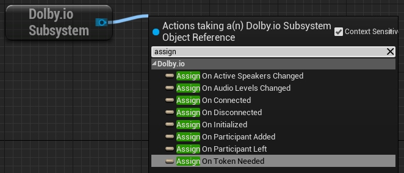
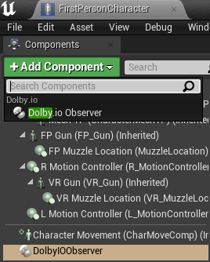

# Dolby.io Virtual World plugin for Unreal Engine
Plugin integrating [Dolby.io Communications](https://dolby.io) with the Unreal Engine.

## Supported environments
- Unreal Engine 4.27.2 and 5.0.3
- Windows 10 and macOS 12

Note: If you want to use the plugin on macOS, see our [advice](#macos-advice).

## Prerequisites
- A [Dolby.io](https://dolby.io) account - if you do not have an account, you can [sign up](https://dolby.io/signup) for free.
- An Unreal project. If you are starting out from scratch, create a project using the First Person template.

## Getting started
1. Download the latest plugin [release](https://github.com/DolbyIO/comms-sdk-unreal/releases).
2. Copy the plugin to {YourGameRoot}/Plugins. Create a Plugins folder if it does not exist.
3. Launch your project.
4. If the plugin is not enabled automatically, enable it manually in the Edit->Plugins window and restart Unreal Editor.
5. You need to handle two events generated by the plugin's Dolby.io Subsystem: [On Token Needed](#on-token-needed) and [On Initialized](#on-initialized). There are more [events](#events), but to get started, you only need to handle these two. You have two basic ways to do this: 
    - From any Blueprint:  
Right-click in the Blueprint and add a Dolby.io Subsystem node (Get DolbyIOSubsystem). Drag off the subsystem and type "assign". You will then need to assign delegates for [On Token Needed](#on-token-needed) and [On Initialized](#on-initialized):  

    - From Blueprints which can contain an Actor Component:  
Open the Blueprint, click Add Component, and select Dolby.io Observer. When you select the DolbyIOObserver component, a convenient list of implementable events appears in the Details panel. Click the plus sign next to [On Token Needed](#on-token-needed) and [On Initialized](#on-initialized), and implement the event handlers in the Blueprint:  
 
6. Use the Dolby.io Subsystem node (Get DolbyIOSubsystem) to call the plugin [functions](#functions) and handle the [events](#events) it generates.

## Events
### On Token Needed
Triggered when an initial or refreshed [client access token](https://docs.dolby.io/communications-apis/docs/overview-developer-tools#client-access-token) is needed, which happens when the game starts or when a refresh token is requested.

After receiving this event, obtain a token for your Dolby.io application and call the [Set Token](#set-token) function.

Example:  


### On Initialized
Triggered when the plugin is successfully initialized after calling the [Set Token](#set-token) function.

After receiving this event, the plugin is ready for use. You can now, for example, call this Blueprint's [Connect](#connect) function. Once connected, the [On Connected](#on-connected) event will trigger.

Example:  


### On Connected
Triggered when the client is successfully connected to the conference after calling the [Connect](#connect) function. The event provides the ID of the local participant in its argument.

### On Disconnected
Triggered when the client is disconnected from the conference by any means; in particular, by the [Disconnect](#disconnect) function.

### On Participant Added
Triggered when a remote participant is added to the conference. Provides information about the participant in its argument.

Example:  


### On Participant Left
Triggered when a remote participant leaves the conference. Provides the participant ID in its argument.

### On Video Track Added
Triggered when a video track is added. Provides the participant ID in its argument.

### On Video Track Removed
Triggered when a video track is removed. Provides the participant ID in its argument.

### On Active Speakers Changed
Triggered when participants start or stop speaking. The event provides the IDs of the current speakers in its argument.

Example:  


### On Audio Levels Changed
Triggered when there are new audio levels available after calling the [Get Audio Levels](#get-audio-levels) function. The event provides two arrays: an array of IDs of the current speakers and an array of floating point numbers representing each participant's audio level. The order of levels corresponds to the order of ActiveSpeakers. A value of 0.0 represents silence and a value of 1.0 represents the maximum volume.

Example:  


## Functions
### Set Token
Initializes or refreshes the client access token. The function takes the token as a parameter and initializes the plugin unless already initialized. Successful initialization triggers the [On Initialized](#on-initialized) event.

For quick testing, you can manually obtain a token from the [Dolby.io dashboard](https://dashboard.dolby.io/) and paste it directly into the node.

Example:  


### Get Dolby.io Token
For convenience during early development and prototyping, this function is provided to acquire the client access token directly from within the application. However, please note **we do not recommend** using this mechanism in the production software for [security best practices](https://docs.dolby.io/communications-apis/docs/guides-client-authentication). App secret needs to be protected and not included in the application.

Example:  


### Connect
Connects to a conference. The method takes a conference name and user name as parameters. Triggers [On Connected](#on-connected) if successful.

Example:  


### Demo Conference
Connects to a demo conference, which automatically brings in 3 invisible bots into the conference as a quick way to validate the connection to the service with audio functionality. The bots are placed at point {0, 0, 0}. Triggers [On Connected](#on-connected) if successful.

Example:  


### Disconnect
Disconnects from the current conference. Triggers [On Disconnected](#on-disconnected) when complete.

### Set Spatial Environment Scale
Sets the spatial environment scale. The larger the scale, the longer the distance at which the spatial audio attenuates. To get the best experience, the scale should be set separately for each level. The default value of "1.0" means that audio will fall completely silent at a distance of 10000 units (10000 cm/100 m).

### Mute Input
Mutes audio input.

### Unmute Input
Unmutes audio input.

### Mute Output
Mutes audio output.

### Unmute Output
Unmutes audio output.

### Enable Video
Enables video streaming from the primary webcam.

### Disable Video
Disables video streaming from the primary webcam.

### Get Texture
Gets the texture to which video from a given participant is being rendered or returns NULL if no such texture exists.

Example:  


### Set Local Player Location
Updates the location of the listener for spatial audio purposes. Calling this function even once disables the default behavior, which is to automatically use the location of the first player controller.

### Set Local Player Rotation
Updates the rotation of the listener for spatial audio purposes. Calling this function even once disables the default behavior, which is to automatically use the rotation of the first player controller.

## Building from source
1. Download and unzip [this](https://github.com/DolbyIO/comms-sdk-cpp/releases/tag/2.3.0-beta.2) Dolby.io Communications C++ SDK release.
2. Place the unzipped sdk-release (sdk-release-x86 for macOS) folder inside the DolbyIO folder.
3. Place the DolbyIO folder in {YourGameRoot}/Plugins. Create a Plugins folder if it does not exist.
4. Regenerate project files.
5. Close Unreal Editor if open.
6. Build the project in the Development Editor configuration.

## macOS advice
Using the plugin in Unreal Editor requires the Editor to obtain microphone and camera permissions. However, Unreal Editor will never ask for the appropriate permissions, so we need to forcefully provide them to the application. One method to do so is to use [this tool](https://github.com/DocSystem/tccutil):  
- Unreal Engine 4: `sudo python tccutil.py -e -id com.epicgames.UE4Editor --microphone --camera`  
- Unreal Engine 5: `sudo python tccutil.py -e -id com.epicgames.UnrealEditor --microphone --camera`

Please be aware that this tool is not endorsed by Dolby in any way and may be dangerous as it needs root permissions to access sensitive system files and requires you to grant full disk access to the terminal. If you do not wish to use it, you will need to find another way to provide the required permissions to the Unreal Editor, otherwise, you will need to package the game to use the plugin and you will be unable to test it in the Editor. In order to package games using the plugin with the data required to request the necessary permissions, you will also need to add these lines:
```
<key>NSMicrophoneUsageDescription</key>
<string>Dolby.io Virtual World</string>
<key>NSCameraUsageDescription</key>
<string>Dolby.io Virtual World</string>
```
in your game's Info.plist or, if you want to automatically add these lines in all packaged games, in {UnrealEngineRoot}/Engine/Source/Runtime/Launch/Resources/Mac/Info.plist. The latter solution is recommended if it does not conflict with your setup because the Info.plist file is overwritten each time the game is packaged.
