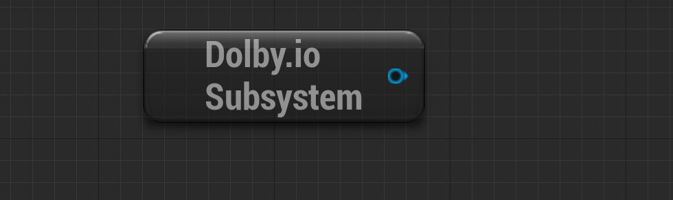
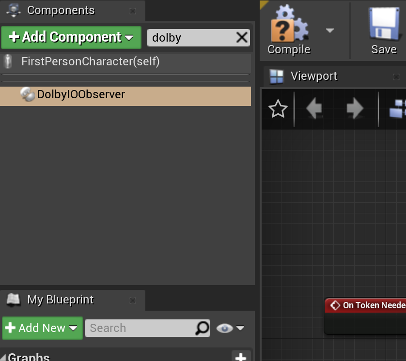
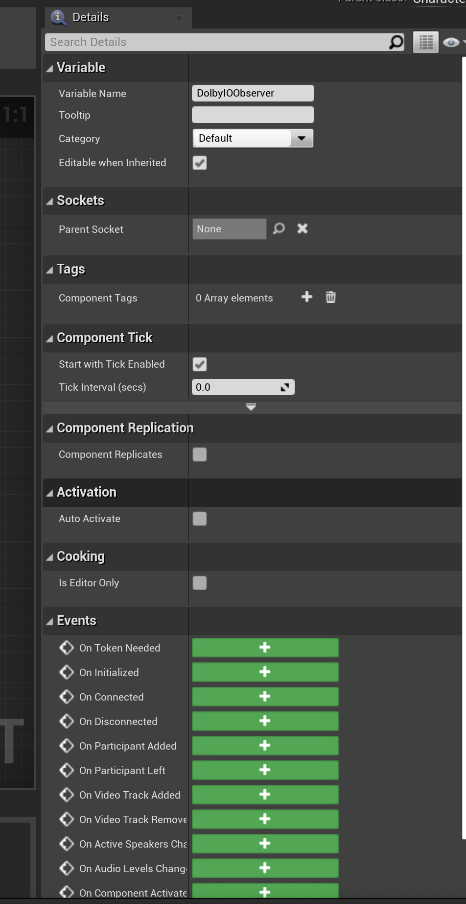
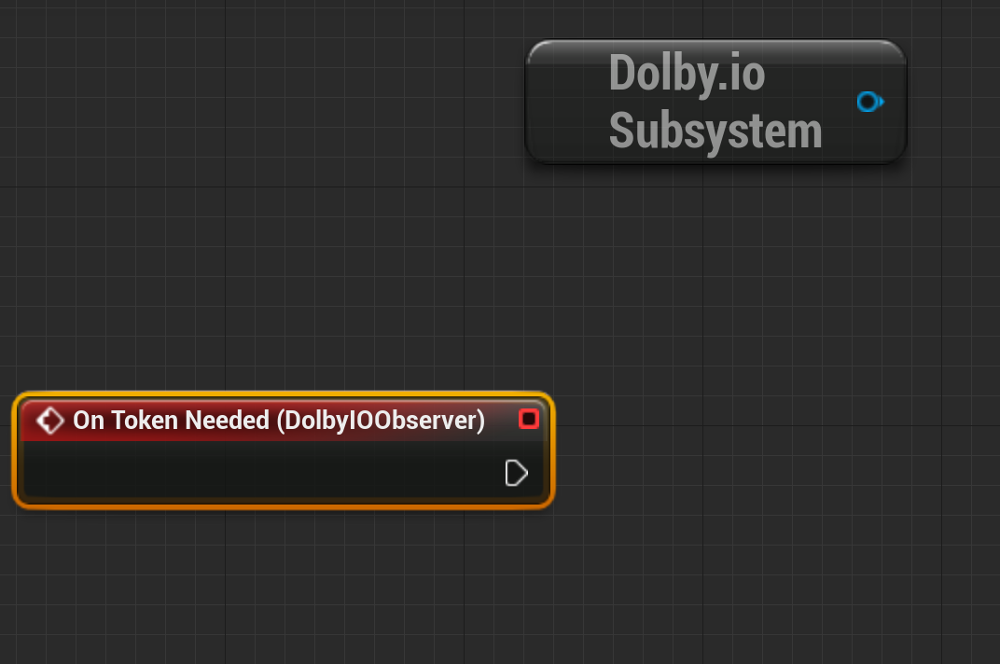
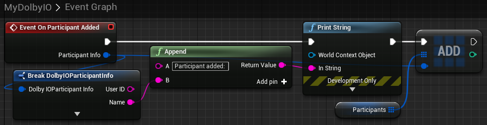
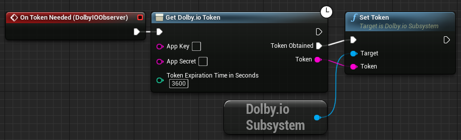

# Dolby.io Virtual World plugin for Unreal Engine
Plugin integrating [Dolby.io Communications APIs](https://dolby.io) with the Unreal Engine.

## Supported platforms
The plugin is compatible with the following Unreal Engine versions:
- 4.27.2
- 5.0.3

The plugin is compatible with the following operating systems:
- Windows 10 or newer
- macOS:
    - UE4: latest Mojave or newer
    - UE5: latest Monterey or newer
    - please see our [advice for macOS](#macos-advice)

## Prerequisites
Before you start, make sure that you have:
- Unreal Engine installed on your computer. For more details, see the [Unreal Engine download](https://www.unrealengine.com/en-US/download) page and the [4.27](https://docs.unrealengine.com/4.27/en-US/Basics/InstallingUnrealEngine/) or [5.0](https://docs.unrealengine.com/5.0/en-US/installing-unreal-engine/) installation manuals.
- An Epic Games [account](https://www.epicgames.com/id/register).
- A [Dolby.io](https://dolby.io) account. If you do not have an account, [sign up](https://dolby.io/signup) for free.
- A client access token or an app key and an app secret copied from the Communications & Media [Dolby.io Dashboard](https://dashboard.dolby.io/).

### A project
If you have your own project you would like to use, please do that.
In case you you would like to just evaluate the plugin, feel free to use First Person Shooter template. Please follow proper manual:
- [manual for Unreal Engine 4.27](https://docs.unrealengine.com/4.27/en-US/ProgrammingAndScripting/ProgrammingWithCPP/CPPTutorials/FirstPersonShooter/)
- or [manual for Unreal Engine 5.0](https://docs.unrealengine.com/5.0/en-US/first-person-template-in-unreal-engine/)

## Getting started
This guide explains how to enable and use the plugin in the Unreal Editor to experience spatial audio in a game.

### Enable the plugin
Download and enable the plugin to be able to use in the Unreal Editor. You can either [use the binary](#using-the-binary) or [build the plugin from source](#building-from-source). On macOS, you need to additionally [obtain](#obtaining-permissions) permissions to use your microphone and camera.

#### Using the binary
1. Make sure that your project contains a `Plugins` folder in the root of your game folder. If you do not have this folder, create it.
2. Download the latest plugin [release](https://github.com/DolbyIO/comms-sdk-unreal/releases) for your platform and unpack the plugin to the `Plugins` folder.
3. Launch your project using the Unreal Editor. If you notice that the plugin is not automatically enabled, select `Edit > Plugins` from the menu to enable the plugin manually. This step requires restarting the editor.

#### Building from source
1. Make sure that your project contains a `Plugins` folder in the root of your game folder. If you do not have this folder, create it.
2. Download the `DolbyIO` folder from [GitHub](https://github.com/DolbyIO/comms-sdk-unreal/tree/main/DolbyIO) and add it to the `Plugins` folder.
3. Download the Dolby.io Communications C++ SDK [2.3.0](https://github.com/DolbyIO/comms-sdk-cpp/releases/tag/2.3.0-beta.2) release for your platform and unzip it.
The unpacked macOS package should contain the `sdk-release-x86` and the `sdk-release-arm` sub-folders, and the downloaded Windows package should be visible as the `sdk-release` folder. The `sdk-release-x86` package is designed for Macs with an Intel processor and `sdk-release-arm` is for Macs with Apple silicon.
4. Move the proper unzipped folder to the `{YourGameRoot}/Plugins/DolbyIO` folder.
5. Regenerate project files and make sure that the Unreal Editor is closed.
6. Build the project using the Development Editor configuration.


Using the plugin in the Unreal Editor requires the editor to obtain microphone and camera permissions. However, on macOS the editor never asks for permissions, so you need to forcefully provide them to your application. To do so, we recommend using the [tccutil](https://github.com/DocSystem/tccutil) permissions manager and the following commands:  
- Epic Games Launcher: `sudo python tccutil.py -e -id com.epicgames.EpicGamesLauncher --microphone --camera`
- Unreal Engine 4: `sudo python tccutil.py -e -id com.epicgames.UE4Editor --microphone --camera`
- Unreal Engine 5: `sudo python tccutil.py -e -id com.epicgames.UnrealEditor --microphone --camera`

Please be aware that this tool is not endorsed by Dolby in any way and may be dangerous as it needs root permissions to access sensitive system files and requires you to grant full disk access to the terminal. If you do not wish to use it, you will need to find another way to provide the required permissions to the Unreal Editor, otherwise, you will need to package the game to use the plugin and you will be unable to test it in the Editor. In order to package games using the plugin with the data required to request the necessary permissions, you will also need to add these lines:
```
<key>NSMicrophoneUsageDescription</key>
<string>Dolby.io Virtual World</string>
<key>NSCameraUsageDescription</key>
<string>Dolby.io Virtual World</string>
```
in your game's Info.plist or, if you want to automatically add these lines in all packaged games, in {UnrealEngineRoot}/Engine/Source/Runtime/Launch/Resources/Mac/Info.plist. The latter solution is recommended if it does not conflict with your setup because the Info.plist file is overwritten each time the game is packaged.

### Use the plugin

After enabling the plugin, you need to add the `Dolby.io Subsystem` node to the Unreal Editor to be able to use the available features. The node represents the Dolby.io library and is responsible for handling the Dolby.io subsystem. Additionally, you need to add the [On Token Needed](#on-token-needed) and [On Initialized](#on-initialized) events to be able to authenticate and initialize the plugin. 

1. Open your Blueprints editor and locate the `Blueprints` folder in the `Content Browser` window visible at the bottom of the editor. Double-click the folder and select the `FirstPersonCharacter` blueprint. This step should open an Event Graph for the selected blueprint.

2. Right-click your blueprint to see a list of all nodes that can be added to the graph, and select `Get DolbyIOSubsystem` from the list. After this step, you should have the `Dolby.io Subsystem` node in your editor.


3. Click the `+Add Component` button located in the `Components` sub-window in the left sidebar, and select `DolbyIOObserver`.


4. Select the added component and check its details in the `Details` sub-window in the right sidebar. Scroll down to the `Events` section to see the available events.


5. Select the `On Token Needed` event from the list by clicking the add button (+). After this step, an `On Token Needed (DolbyIOObserver)` element should appear in your editor.  


6. Provide either your token or your app key and app secret to the event.

    If you want to use a client access token, follow these steps:
    
    1. Right-click the Blueprint to see the `All Possible Actions` window. Tick off `Context Sensitive` to see all available components and actions, and add a `Set Token` action.
    
    2. Connect the `On Token Needed (DolbyIOObserver)` element with the `Set Token` action.
    
    
    3. Provide your client access token copied from the Dolby.io dashboard to the `Set Token` action.
    
    If you want to use an app key and an app secret, follow these steps:
    
    1. Right-click the Blueprint to see the `All Possible Actions` window. Tick off `Context Sensitive` to see all available components and actions, and add a `Get Dolby.io Token` component.
    
    2. Right-click the Blueprint and add a `Set Token` action.
    
    3. Connect `On Token Needed` with `Get Dolby.io Token`.
    
    4. Connect `Get Dolby.io Token` with `Set Token`, and connect their `Token` pins.
    
    5. Connect the `Target` pins of `Set Token` and `Dolby.io Subsystem`.
    
    
    6. Provide your app key and app secret to the `Get Dolby.io Token` component.

7. Add an `On Initialized` event by clicking the add button (+) next to the event located in the `Details` sub-window. After this step, the `On Initialized (DolbyIOObserver)` element should appear in the main window.

8. Right-click the Blueprint, add a `Demo Conference` component and connect the component with the `On Initialized` event.


9. Click `Compile`, and then click `Play`. After this step, you should be able to run First Person Example and enjoy spatial audio.

## Events
Below sections desribe events provided by *Dolby.io Subsystem* node.
### On Token Needed
Triggered when an initial or refreshed [client access token](https://docs.dolby.io/communications-apis/docs/overview-developer-tools#client-access-token) is needed, which happens when the game starts or when a refresh token is requested.

After receiving this event, obtain a token for your Dolby.io application and call the [Set Token](#set-token) function.

Example:  


### On Initialized
Triggered when the plugin is successfully initialized after calling the [Set Token](#set-token) function.

After receiving this event, the plugin is ready for use. You can now, for example, call this Blueprint's [Connect](#connect) function. Once connected, the [On Connected](#on-connected) event will trigger.

Example:  


### On Connected
Triggered when the client is successfully connected to the conference after calling the [Connect](#connect) function. The event provides the ID of the local participant in its argument.

### On Disconnected
Triggered when the client is disconnected from the conference by any means; in particular, by the [Disconnect](#disconnect) function.

### On Participant Added
Triggered when a remote participant is added to the conference. Provides information about the participant in its argument.

Example:  


### On Participant Left
Triggered when a remote participant leaves the conference. Provides the participant ID in its argument.

### On Video Track Added
Triggered when a video track is added. Provides the participant ID in its argument.

### On Video Track Removed
Triggered when a video track is removed. Provides the participant ID in its argument.

### On Active Speakers Changed
Triggered when participants start or stop speaking. The event provides the IDs of the current speakers in its argument.

Example:  


### On Audio Levels Changed
Triggered when there are new audio levels available after calling the [Get Audio Levels](#get-audio-levels) function. The event provides two arrays: an array of IDs of the current speakers and an array of floating point numbers representing each participant's audio level. The order of levels corresponds to the order of ActiveSpeakers. A value of 0.0 represents silence and a value of 1.0 represents the maximum volume.

Example:  


## Functions
### Set Token
Initializes or refreshes the client access token. The function takes the token as a parameter and initializes the plugin unless already initialized. Successful initialization triggers the [On Initialized](#on-initialized) event.

For quick testing, you can manually obtain a token from the [Dolby.io dashboard](https://dashboard.dolby.io/) and paste it directly into the node.

Example:  


### Get Dolby.io Token
For convenience during early development and prototyping, this function is provided to acquire the client access token directly from within the application. However, please note **we do not recommend** using this mechanism in the production software for [security best practices](https://docs.dolby.io/communications-apis/docs/guides-client-authentication). App secret needs to be protected and not included in the application.

Example:  


### Connect
Connects to a conference. The method takes a conference name and user name as parameters. Triggers [On Connected](#on-connected) if successful.

Example:  


### Demo Conference
Connects to a demo conference, which automatically brings in 3 invisible bots into the conference as a quick way to validate the connection to the service with audio functionality. The bots are placed at point {0, 0, 0}. Triggers [On Connected](#on-connected) if successful.

Example:  


### Disconnect
Disconnects from the current conference. Triggers [On Disconnected](#on-disconnected) when complete.

### Set Spatial Environment Scale
Sets the spatial environment scale. The larger the scale, the longer the distance at which the spatial audio attenuates. To get the best experience, the scale should be set separately for each level. The default value of "1.0" means that audio will fall completely silent at a distance of 10000 units (10000 cm/100 m).

### Mute Input
Mutes audio input.

### Unmute Input
Unmutes audio input.

### Mute Output
Mutes audio output.

### Unmute Output
Unmutes audio output.

### Enable Video
Enables video streaming from the primary webcam.

### Disable Video
Disables video streaming from the primary webcam.

### Get Texture
Gets the texture to which video from a given participant is being rendered or returns NULL if no such texture exists.

Example:  


### Set Local Player Location
Updates the location of the listener for spatial audio purposes. Calling this function even once disables the default behavior, which is to automatically use the location of the first player controller.

### Set Local Player Rotation
Updates the rotation of the listener for spatial audio purposes. Calling this function even once disables the default behavior, which is to automatically use the rotation of the first player controller.
