# Dolby.io Virtual World plugin for Unreal Engine
Plugin integrating [Dolby.io Communications](https://dolby.io) with the Unreal Engine.

## Supported environments
- Unreal Engine 4.27.2 and 5.0.3
- Windows 10 and macOS 12

Note: If you want to use the plugin on macOS, see our [advice](#macos-advice).

## Prerequisites
- A [Dolby.io](https://dolby.io) account - if you do not have an account, you can [sign up](https://dolby.io/signup) for free.

## Getting started
1. Download the latest plugin [release](https://github.com/DolbyIO/comms-sdk-unreal/releases).
2. Copy the plugin to {UnrealEngineRoot}/Engine/Plugins, so that you have a folder such as C:\Epic Games\UE_4.27\Engine\Plugins\DolbyIO.  
*Alternatively, copy the plugin to {YourGameRoot}/Plugins.*
3. Launch your game project. If you are starting out from scratch, create a game using the First Person template.
4. If the plugin is not enabled automatically, enable it manually in the Edit->Plugins window and restart Unreal Editor.
5. Create a new Blueprint class and choose DolbyIO as parent class.
6. In the Event Graph of the newly created Blueprint, hover over Functions on the left and select Override->[On Token Needed](#on-token-needed). You will also need to override [On Initialized](#on-initialized). Both events should appear in the Blueprint. There are more [events](#events), but to get started, you only need to handle these two.

## Events
### On Token Needed
An initial or refreshed [client access token](https://docs.dolby.io/communications-apis/docs/overview-developer-tools#client-access-token) is needed. Triggered when the game starts or when a refresh token is requested.

When this event is received, you should obtain a token for your Dolby.io application and call the [Set Token](#set-token) function.

Example:  


### On Initialized
The plugin is successfully initialized. Triggered by the [Set Token](#set-token) function.

When this event is received, the plugin is ready for use. You can now, for example, call this Blueprint's [Connect](#connect) function. Once connected, the [On Connected](#on-connected) event will trigger.

Example:  
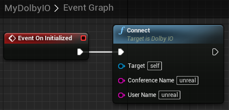

### On Connected
Successfully connected to conference. Triggered by the [Connect](#connect) function. Provides the ID of the local participant in its argument.

Example:  
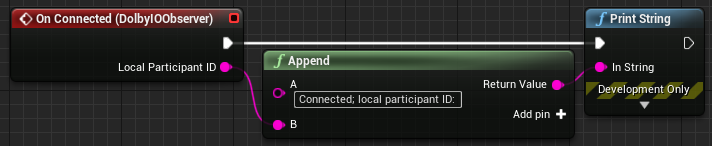

### On Disconnected
Disconnected from conference. Triggered when disconnected by any means (in particular by the [Disconnect](#disconnect) function).

Example:  
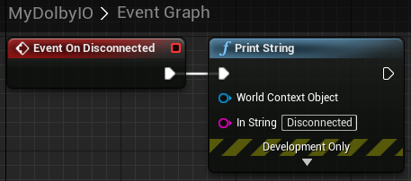

### On Remote Participants Changed
Triggered when participants are added to or removed from the conference. Provides the IDs of the remote participants in its argument.

Example:  
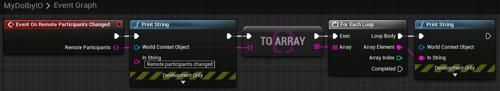

### On Active Speakers Changed
Triggered when participants start or stop speaking. Provides the IDs of the current speakers in its argument.

Example:  
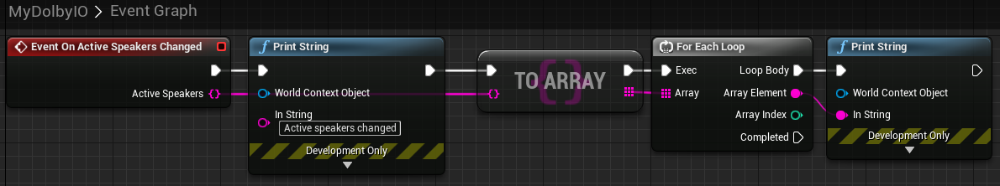

### On Audio Levels Changed
There are new audio levels available. Provides a string-to-float mapping of participant IDs to their audio levels (0.0 is silent, 1.0 is loudest) in its argument. Triggered by the [Get Audio Levels](#get-audio-levels) function.

Example:  
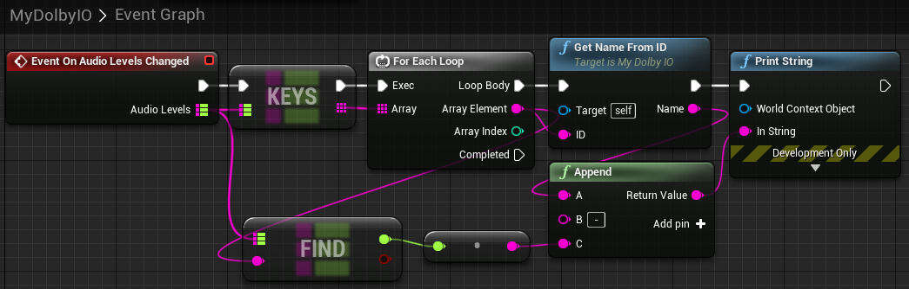

## Functions
### Set Token
Initializes or refreshes the client access token. Takes the token as parameter. Initializes the plugin unless already initialized. Triggers [On Initialized](#on-initialized) if initialization was successful.

For quick testing, you can manually obtain a token from the [Dolby.io dashboard](https://dashboard.dolby.io/) and paste it directly into the node.

You may use the [Set Token Using Key and Secret](#set-token-using-key-and-secret) function instead for convenience during onboarding.

Example:  


### Set Token Using Key and Secret
Similar to [Set Token](#set-token) except it takes an app key and secret as parameters and automatically generates a token. **Do not use this function in production and do not allow your app key and secret to leak.**

Example:  
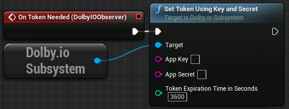

### Connect
Connects to a conference. Takes a conference name and user name as parameters. Triggers [On Connected](#on-connected) if successful.

Example:  
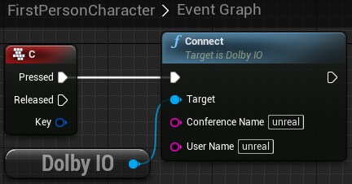

### Disconnect
Disconnects from the current conference. Triggers [On Disconnected](#on-disconnected) when complete.

Example:  
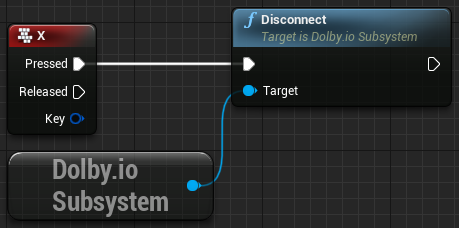

### Mute Input
Mutes audio input. Has no effect unless connected.

### Unmute Input
Unmutes audio input. Has no effect unless connected.

Example:  
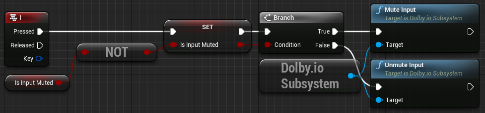

### Mute Output
Mutes audio output. Has no effect unless connected.

### Unmute Output
Unmutes audio output. Has no effect unless connected.

Example:  
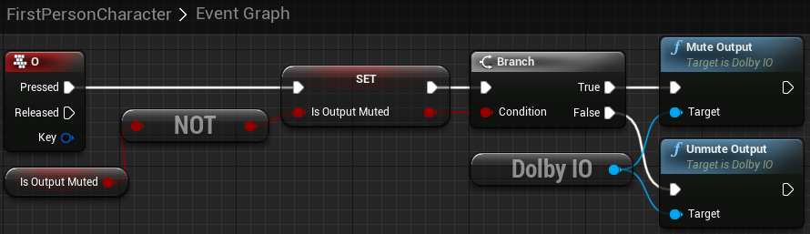

### Get Audio Levels
Gets audio levels for all speaking participants. Triggers [On Audio Levels Changed](#on-audio-levels-changed) if successful.

Example:  


### Update View Point
Updates the position and rotation for spatial audio purposes. Takes the position and rotation of the listener as parameters. Calling this function even once disables the default behavior, which is to automatically use the location and rotation of the first player controller.

Example:  
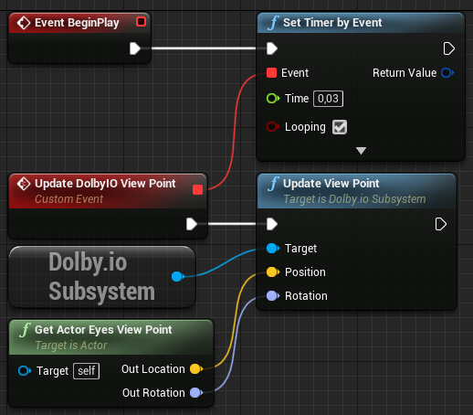

## Building from source
1. Download and unzip the latest Dolby.io Communications C++ SDK [release](https://github.com/DolbyIO/comms-sdk-cpp/releases).
2. Copy or link the unzipped sdk-release folder into the DolbyIO/Source/ThirdParty folder.
3. Launch your game project. If you are starting out from scratch, create a game using the First Person C++ template.
4. Create a folder named "Plugins" in your game's root folder if it does not exist.
5. Copy or link the DolbyIO folder into the Plugins folder.
6. Regenerate IDE project files.
7. Close Unreal Editor.
8. Build your game in the Development Editor configuration.

## macOS advice
Using the plugin in Unreal Editor requires the Editor to obtain microphone permissions. However, Unreal Editor will never ask for the appropriate permissions, so we need to forcefully provide them to the application. One method to do so is to use [this tool](https://github.com/DocSystem/tccutil):  
- Unreal Engine 4: `sudo python tccutil.py -e -id com.epicgames.UE4Editor --microphone`  
- Unreal Engine 5: `sudo python tccutil.py -e -id com.epicgames.UnrealEditor --microphone`

Please be aware that this tool is not endorsed by Dolby in any way and may be dangerous as it needs root permissions to access sensitive system files and requires you to grant full disk access to the terminal. If you do not wish to use it, you will need to find another way to provide microphone permissions to the Unreal Editor, otherwise, you will need to package the game to use the plugin and you will be unable to test it in the Editor. In order to package games using the plugin with the data required to request microphone permissions, you will also need to add these lines:
```
<key>NSMicrophoneUsageDescription</key>
<string>Dolby.io Communications</string>
```
in your game's Info.plist or, if you want to automatically add these lines in all packaged games, in {UnrealEngineRoot}/Engine/Source/Runtime/Launch/Resources/Mac/Info.plist. The latter solution is recommended if it does not conflict with your setup, because the Info.plist file is overwritten each time the game is packaged.
