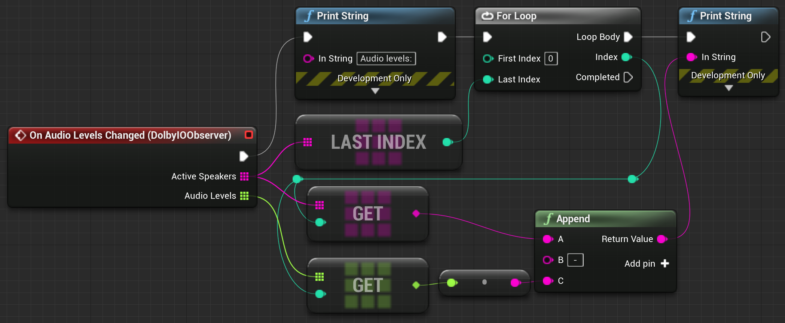

Triggered when there are new audio levels available. The event provides two arrays: an array of IDs of the current speakers and an array of floating point numbers representing each participant's audio level. The order of levels corresponds to the order of ActiveSpeakers. A value of 0.0 represents silence and a value of 1.0 represents the maximum volume.

Example:

