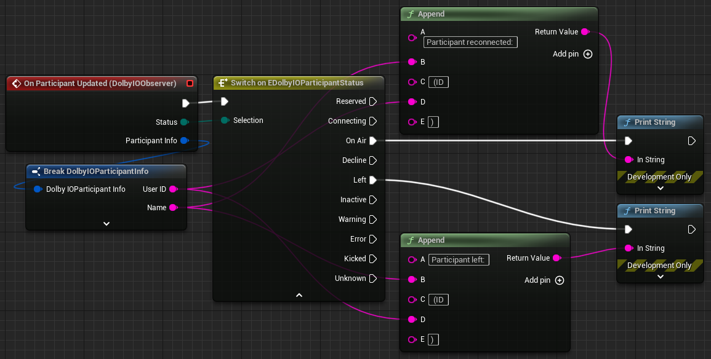

Triggered when a remote participant's status is updated. The event provides the participant status and participant info in its arguments.

Example:

The following graphic shows possible status changes:
