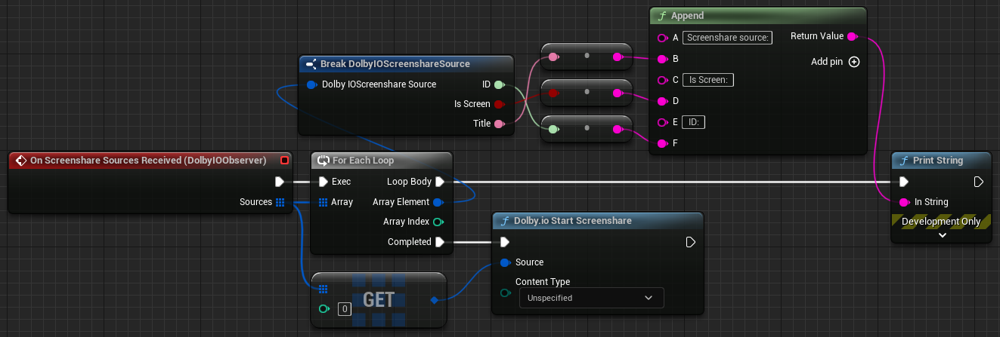

Triggered when screen share sources are received as a result of calling [Get Screenshare Sources](../Functions/get-screenshare-sources). Each source consists of an ID, a title, and a boolean indicating whether it is a screen (true) or a window (false). One of these sources should be passed to the [Start Screenshare](../Functions/start-screenshare) function to begin sharing a screen.

Example:

