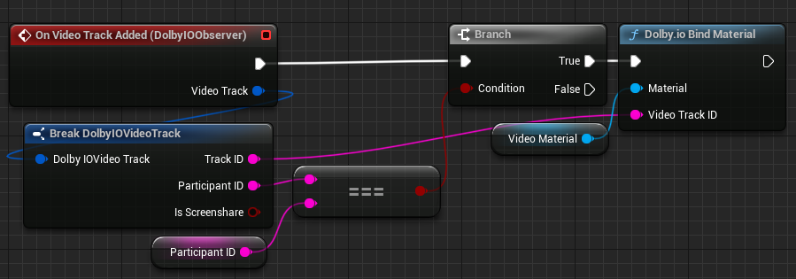

Triggered when a video track is added. The event provides information about the video track in its argument. This information consists of the track ID, the ID of the participant from whom the track is coming, and a boolean indicating whether this is a screen share video track or a camera video track.

> **_NOTE:_** The event is not triggered when the user [enables their own camera](../Functions/enable-video) or [starts their own screen share](../Functions/start-screenshare). For events related to these actions, see [On Video Enabled](on-video-enabled) and [On Screenshare Started](on-screenshare-started) respectively.

The event is supported in the Dolby.io Virtual World plugin for Unreal Engine 1.1.0 and later.

For example usage, see the [remote video rendering tutorial](../../tutorial/remote-video).

Another example:

