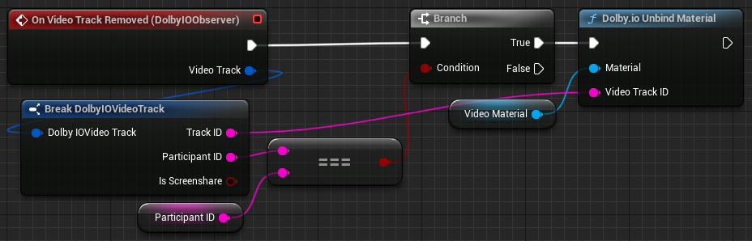

Triggered when a video track is removed. Provides information about the video track in its argument. This information consists of the track ID, the ID of the participant from whom the track is coming and a boolean indicating whether this is a screenshare video track or a camera video track.

