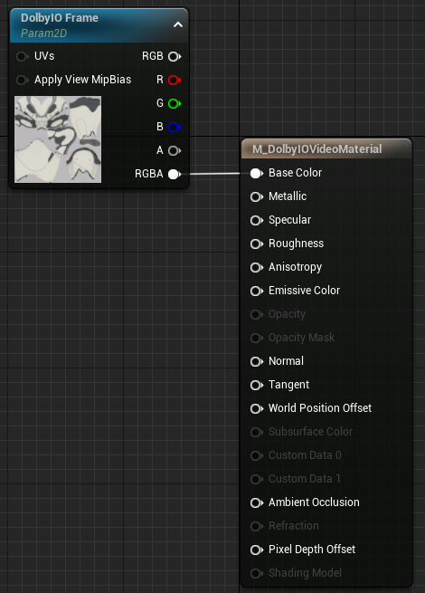
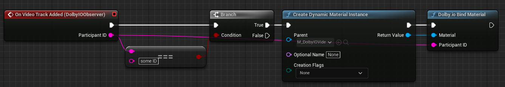

Binds a dynamic material instance to hold the frames of the given video track. The plugin will update the material's texture parameter named "DolbyIO Frame" with the necessary data, therefore the material should have such a parameter to be usable. Automatically unbinds the material from all other tracks, but it is possible to bind multiple materials to the same track. Has no effect if the track does not exist at the moment the function is called, therefore it should usually be called as a response to the "On Video Track Added" event.

# Set up material

- Add a new Material in the Content Browser.
- Double-click the newly-created material. The material editor will open.
- Add a Texture Sample node into the material graph.
    - Left-click while holding "T". Otherwise just right-click and search for Texture Sample.
- Right-click on the newly-created node and select "Convert to Parameter".
- **Rename the node from "Param" to "DolbyIO Frame".**
- Use the node as you please.
    - If your material is completely empty and you do not wish to perform any processing on the video frame, just plug the RGBA output node to the Base Color input node.

# Bind material

With your material set up as above, you can now use the Bind Material function on dynamic instances of the material, as seen in the example below.

