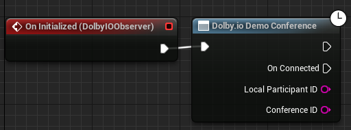

Connects to a demo conference, which automatically brings in 3 invisible bots into the conference as a quick way to validate the connection to the service with audio functionality. The bots are placed at point {0, 0, 0}. Triggers [On Connected](../Events/on-connected) event if successful.

