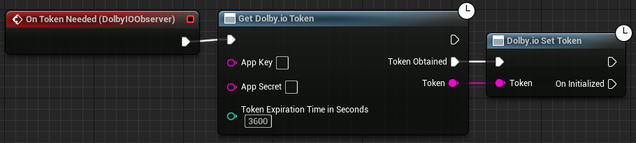

For convenience during early development and prototyping, this function is provided to acquire the client access token directly from within the application. 

> ⚠️ Using this function effectively distributes the permanent app credential with your Unity application, which is not safe for production deployment. Follow our [security best practices](https://docs.dolby.io/communications-apis/docs/guides-client-authentication) here to set up a server through which you can acquire a temporary client access token.

