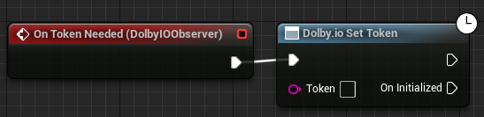

Initializes or refreshes the client access token. The function takes the token as a parameter and initializes the plugin unless already initialized. Successful initialization triggers the [On Initialized](../Events/on-initialized) event.

For quick testing, you can manually obtain a token from the [Dolby.io dashboard](https://dashboard.dolby.io/) and paste it directly into the node.

