# Functions

## Dolby.io Bind Material

Binds a dynamic material instance to hold the frames of the given video track. The plugin will update the material's texture parameter named "DolbyIO Frame" with the necessary data, therefore the material should have such a parameter to be usable. Automatically unbinds the material from all other tracks, but it is possible to bind multiple materials to the same track. Has no effect if the track does not exist at the moment the function is called, therefore it should usually be called as a response to the [On Video Track Added](events.md#on-video-track-added) event.

#### Inputs and outputs
| Name               | Direction | Type                                                                                                                                | Default value | Description                            |
|--------------------|:----------|:------------------------------------------------------------------------------------------------------------------------------------|:--------------|:---------------------------------------|
| **Material**       | Input     | [Dynamic Material Instance](https://docs.unrealengine.com/5.2/en-US/BlueprintAPI/Rendering/Material/CreateDynamicMaterialInstance/) | -             | The dynamic material instance to bind. |
| **Video Track ID** | Input     | string                                                                                                                              | -             | The ID of the video track.             |

---

## Dolby.io Broadcast Message

:::info 🚀 Beta
This function is a part of the [Beta program](https://docs.dolby.io/communications-apis/docs/overview-beta-programs).
:::

Sends a message to all participants in the current conference. The message size is limited to 16KB.

This function calls [Dolby.io Send Message](#dolbyio-send-message) with an empty array of selected participants.

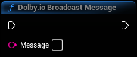

#### Inputs and outputs
| Name        | Direction | Type   | Default value | Description          |
|-------------|:----------|:-------|:--------------|:---------------------|
| **Message** | Input     | string | -             | The message to send. |

---

## Dolby.io Change Screenshare Parameters

Changes the screen sharing parameters if already sharing screen.

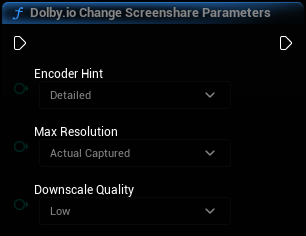

#### Inputs and outputs
| Name                  | Direction | Type                                                                                      | Default value   | Description                                                                                     |
|-----------------------|:----------|:------------------------------------------------------------------------------------------|:----------------|:------------------------------------------------------------------------------------------------|
| **Encoder Hint**      | Input     | [Dolby.io Screenshare Encoder Hint](types.mdx#dolbyio-screenshare-encoder-hint)           | Detailed        | Provides a hint to the plugin as to what type of content is being captured by the screen share. |
| **Max Resolution**    | Input     | [Dolby.io Screenshare Max Resolution](types.mdx#dolbyio-screenshare-max-resolution)       | Actual Captured | The maximum resolution for the capture screen content to be shared as.                          |
| **Downscale Quality** | Input     | [Dolby.io Screenshare Downscale Quality](types.mdx#dolbyio-screenshare-downscale-quality) | Low             | The quality for the downscaling algorithm to be used.                                           |

---

## Dolby.io Connect

:::info 🚀 Beta
The **Video Codec** parameter is a part of the [Beta program](https://docs.dolby.io/communications-apis/docs/overview-beta-programs).
:::

Connects to a conference.

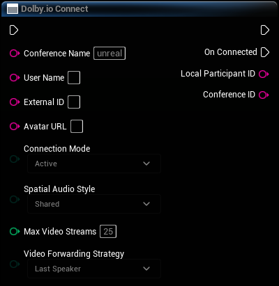

#### Inputs and outputs
| Name                          | Direction | Type                                                                              | Default value | Description                                                                                                                                                                                                                                   |
|-------------------------------|:----------|:----------------------------------------------------------------------------------|:--------------|:----------------------------------------------------------------------------------------------------------------------------------------------------------------------------------------------------------------------------------------------|
| **Conference Name**           | Input     | string                                                                            | "unreal"      | The conference name. Must not be empty.                                                                                                                                                                                                       |
| **User Name**                 | Input     | string                                                                            | ""            | The name of the participant.                                                                                                                                                                                                                  |
| **External ID**               | Input     | string                                                                            | ""            | The external unique identifier that the customer's application can add to the participant while opening a session. If a participant uses the same external ID in conferences, the participant's ID also remains the same across all sessions. |
| **Avatar URL**                | Input     | string                                                                            | ""            | The URL of the participant's avatar.                                                                                                                                                                                                          |
| **Connection Mode**           | Input     | [Dolby.io Connection Mode](types.mdx#dolbyio-connection-mode)                     | Active        | Defines whether to connect as an active user or a listener.                                                                                                                                                                                   |
| **Spatial Audio Style**       | Input     | [Dolby.io Spatial Audio Style](types.mdx#dolbyio-spatial-audio-style)             | Shared        | The spatial audio style of the conference.                                                                                                                                                                                                    |
| **Max Video Streams**         | Input     | integer                                                                           | 25            | Sets the maximum number of video streams that may be transmitted to the user.                                                                                                                                                                 |
| **Video Forwarding Strategy** | Input     | [Dolby.io Video Forwarding Strategy](types.mdx#dolbyio-video-forwarding-strategy) | LastSpeaker   | Defines how the plugin should select conference participants whose videos will be transmitted to the local participant.                                                                                                                       |
| **Video Codec**               | Input     | [Dolby.io Video Codec](types.mdx#dolbyio-video-codec)                             | H264          | The preferred video codec.                                                                                                                                                                                                                    |

#### Triggered events
| Event                                      | When         |
|--------------------------------------------|:-------------|
| [**On Connected**](events.md#on-connected) | Successful   |
| [**On Error**](events.md#on-error)         | Errors occur |

---

## Dolby.io Demo Conference

Connects to a demo conference.

The demo automatically brings in 3 invisible bots into the conference as a quick way to validate the connection to the service with audio functionality. The bots are placed at point {0, 0, 0}.

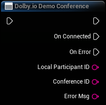

#### Triggered events
| Event                                      | When         |
|--------------------------------------------|:-------------|
| [**On Connected**](events.md#on-connected) | Successful   |
| [**On Error**](events.md#on-error)         | Errors occur |

---

## Dolby.io Disable Video

Disables video streaming.

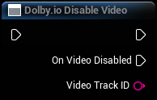

#### Triggered events
| Event                                                | When         |
|------------------------------------------------------|:-------------|
| [**On Video Disabled**](events.md#on-video-disabled) | Successful   |
| [**On Error**](events.md#on-error)                   | Errors occur |

---

## Dolby.io Disconnect

Disconnects from the current conference.

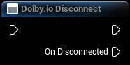

#### Triggered events
| Event                                         | When         |
|-----------------------------------------------|:-------------|
| [**On Disconnected**](events.md#on-connected) | Successful   |
| [**On Error**](events.md#on-error)            | Errors occur |

---

## Dolby.io Enable Video

:::info 🚀 Beta
The **Blur Background** parameter is a part of the [Beta program](https://docs.dolby.io/communications-apis/docs/overview-beta-programs).
:::

Enables video streaming from the given video device or the default device if no device is given.

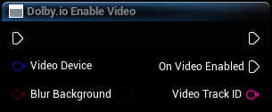

#### Inputs and outputs
| Name                | Direction | Type                                                    | Default value  | Description                                                                                                              |
|---------------------|:----------|:--------------------------------------------------------|:---------------|:-------------------------------------------------------------------------------------------------------------------------|
| **VideoDevice**     | Input     | [Dolby.io Video Device](types.mdx#dolbyio-video-device) | default device | The video device to use.                                                                                                 |
| **Blur Background** | Input     | bool                                                    | false          | Indicates whether the background should be blurred. This parameter is ignored on platforms other than Windows and macOS. |

#### Triggered events
| Event                                              | When         |
|----------------------------------------------------|:-------------|
| [**On Video Enabled**](events.md#on-video-enabled) | Successful   |
| [**On Error**](events.md#on-error)                 | Errors occur |

---

## Dolby.io Get Audio Input Devices

Gets a list of all available audio input devices.

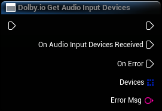

#### Triggered events
| Event                                                                            | When         |
|----------------------------------------------------------------------------------|:-------------|
| [**On Audio Input Devices Received**](events.md#on-audio-input-devices-received) | Successful   |
| [**On Error**](events.md#on-error)                                               | Errors occur |

---

## Dolby.io Get Audio Output Devices

Gets a list of all available audio output devices.

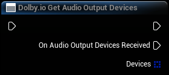

#### Triggered events
| Event                                                                              | When         |
|------------------------------------------------------------------------------------|:-------------|
| [**On Audio Output Devices Received**](events.md#on-audio-output-devices-received) | Successful   |
| [**On Error**](events.md#on-error)                                                 | Errors occur |

---

## Dolby.io Get Current Audio Input Device

Gets the current audio input device.

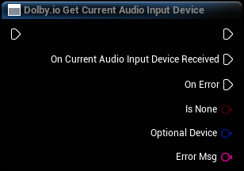

#### Triggered events
| Event                                                                                          | When         |
|------------------------------------------------------------------------------------------------|:-------------|
| [**On Current Audio Input Device Received**](events.md#on-current-audio-input-device-received) | Successful   |
| [**On Error**](events.md#on-error)                                                             | Errors occur |

---

## Dolby.io Get Current Audio Output Device

Gets the current audio output device.

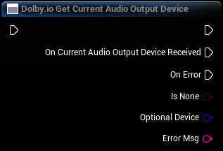

#### Triggered events
| Event                                                                                            | When         |
|--------------------------------------------------------------------------------------------------|:-------------|
| [**On Current Audio Output Device Received**](events.md#on-current-audio-output-device-received) | Successful   |
| [**On Error**](events.md#on-error)                                                               | Errors occur |

---

## Dolby.io Get Current Screenshare Source

:::info 🚀 Beta
This function is a part of the [Beta program](https://docs.dolby.io/communications-apis/docs/overview-beta-programs).
:::

Gets the current screenshare source.

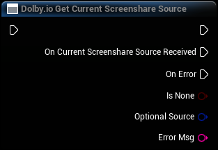

#### Triggered events
| Event                                                                                          | When         |
|------------------------------------------------------------------------------------------------|:-------------|
| [**On Current Screenshare Source Received**](events.md#on-current-screenshare-source-received) | Successful   |
| [**On Error**](events.md#on-error)                                                             | Errors occur |

---

## Dolby.io Get Current Video Device

:::info 🚀 Beta
This function is a part of the [Beta program](https://docs.dolby.io/communications-apis/docs/overview-beta-programs).
:::

Gets the current video device.

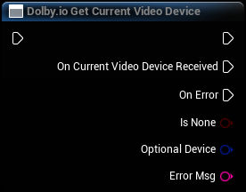

#### Triggered events
| Event                                                                              | When         |
|------------------------------------------------------------------------------------|:-------------|
| [**On Current Video Device Received**](events.md#on-current-video-device-received) | Successful   |
| [**On Error**](events.md#on-error)                                                 | Errors occur |

---

## Dolby.io Get Participants

Gets a list of all remote participants.

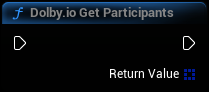

#### Inputs and outputs
| Name             | Direction | Type                                                                     | Default value | Description                                      |
|------------------|:----------|:-------------------------------------------------------------------------|:--------------|:-------------------------------------------------|
| **Return Value** | Output    | array of [Dolby.io Participant Info](types.mdx#dolbyio-participant-info) | -             | An array of current Dolby.io Participant Info's. |

---

## Dolby.io Get Screenshare Sources

Gets a list of all possible screen sharing sources. These can be entire screens or specific application windows.

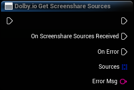

#### Triggered events
| Event                                                                            | When         |
|----------------------------------------------------------------------------------|:-------------|
| [**On Screenshare Sources Received**](events.md#on-screenshare-sources-received) | Successful   |
| [**On Error**](events.md#on-error)                                               | Errors occur |

---

## Dolby.io Get Texture

Gets the texture to which video from a given track is being rendered.

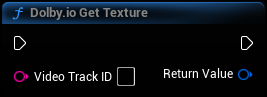

#### Inputs and outputs
| Name               | Direction | Type                                                                               | Default value | Description                                                                    |
|--------------------|:----------|:-----------------------------------------------------------------------------------|:--------------|:-------------------------------------------------------------------------------|
| **Video Track ID** | Input     | string                                                                             | -             | The ID of the video track.                                                     |
| **Return Value**   | Output    | [Texture](https://docs.unrealengine.com/5.2/en-US/BlueprintAPI/Rendering/Texture/) | -             | The texture holding the video track's frame or NULL if no such texture exists. |

---

## Dolby.io Get Token From URL

:::info 🚀 Beta
This function is a part of the [Beta program](https://docs.dolby.io/communications-apis/docs/overview-beta-programs).
:::

Gets a Dolby.io client access token from a URL.

For convenience during early development and prototyping, this function is provided to acquire a client access token directly from the game.

> ⚠️ Using this function effectively distributes the permanent app credential with your Unreal application, which is not safe for production deployment. Follow our [security best practices](https://docs.dolby.io/communications-apis/docs/guides-client-authentication) to set up a server through which you can acquire a temporary client access token.

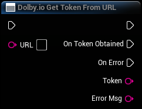

#### Inputs and outputs
| Name    | Direction | Type   | Default value | Description                         |
|---------|:----------|:-------|:--------------|:------------------------------------|
| **URL** | Input     | string | -             | The URL to use to obtain the token. |

#### Triggered events
| Event                                                | When       |
|------------------------------------------------------|:-----------|
| [**On Token Obtained**](events.md#on-token-obtained) | Successful |

---

## Dolby.io Get Token Using App Key And Secret

:::info 🚀 Beta
The function is a part of the [Beta program](https://docs.dolby.io/communications-apis/docs/overview-beta-programs) and replaces **Get Dolby.io Token**. The behavior of **Get Dolby.io Token** remains unchanged; we only renamed the function.
:::

Gets a Dolby.io client access token using an app key and secret combination.

For convenience during early development and prototyping, this function is provided to acquire a client access token directly from the game.

> ⚠️ Using this function effectively distributes the permanent app credential with your Unreal application, which is not safe for production deployment. Follow our [security best practices](https://docs.dolby.io/communications-apis/docs/guides-client-authentication) to set up a server through which you can acquire a temporary client access token.

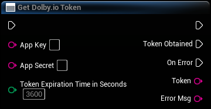

#### Inputs and outputs
| Name                                 | Direction | Type    | Default value | Description                               |
|--------------------------------------|:----------|:--------|:--------------|:------------------------------------------|
| **App Key**                          | Input     | string  | -             | The app key.                              |
| **App Secret**                       | Input     | string  | -             | The app secret.                           |
| **Token Expiration Time In Seconds** | Input     | integer | 3600 (1 hour) | The token's expiration time (in seconds). |

#### Triggered events
| Event                                             | When         |
|---------------------------------------------------|:-------------|
| [**Token Obtained**](events.md#on-token-obtained) | Successful   |
| [**On Error**](events.md#on-error)                | Errors occur |

---

## Dolby.io Get Video Devices

Gets a list of all available video devices.

#### Triggered events
| Event                                                                | When         |
|----------------------------------------------------------------------|:-------------|
| [**On Video Devices Received**](events.md#on-video-devices-received) | Successful   |
| [**On Error**](events.md#on-error)                                   | Errors occur |

---

## Dolby.io Mute Input

Mutes audio input.

---

## Dolby.io Mute Output

Mutes audio output.

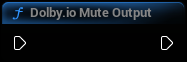

---

## Dolby.io Mute Participant

Mutes a given participant for the local user.

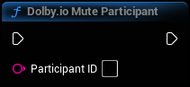

#### Inputs and outputs
| Name               | Direction | Type   | Default value | Description                               |
|--------------------|:----------|:-------|:--------------|:------------------------------------------|
| **Participant ID** | Input     | string | -             | The ID of the remote participant to mute. |

---

## Dolby.io Send Message

:::info 🚀 Beta
This function is a part of the [Beta program](https://docs.dolby.io/communications-apis/docs/overview-beta-programs).
:::

Sends a message to selected participants in the current conference. The message size is limited to 16KB.

#### Inputs and outputs
| Name                | Direction | Type             | Default value | Description                                                                                                                            |
|---------------------|:----------|:-----------------|:--------------|:---------------------------------------------------------------------------------------------------------------------------------------|
| **Message**         | Input     | string           | -             | The message to send.                                                                                                                   |
| **Participant IDs** | Input     | array of strings | -             | The participants to whom the message should be sent. If an empty array is provided, the message will be broadcast to all participants. |

---

## Dolby.io Set Audio Capture Mode

:::info 🚀 Beta
This function is a part of the [Beta program](https://docs.dolby.io/communications-apis/docs/overview-beta-programs).
:::

Sets the preferred noise reduction mode and voice font.

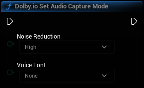

#### Inputs and outputs
| Name                | Direction | Type                                                          | Default value | Description               |
|---------------------|:----------|:--------------------------------------------------------------|:--------------|:--------------------------|
| **Noise Reduction** | Input     | [Dolby.io Noise Reduction](types.mdx#dolbyio-noise-reduction) | -             | The noise reduction mode. |
| **Voice Font**      | Input     | [Dolby.io Voice Font](types.mdx#dolbyio-voice-font)           | -             | The voice font.           |

---

## Dolby.io Set Audio Input Device

Sets the audio input device.

#### Inputs and outputs
| Name          | Direction | Type   | Default value | Description                  |
|---------------|:----------|:-------|:--------------|:-----------------------------|
| **Native ID** | Input     | string | -             | The ID of the device to use. |

#### Triggered events
| Event                                                                                        | When       |
|----------------------------------------------------------------------------------------------|:-----------|
| [**On Current Audio Input Device Changed**](events.md#on-current-audio-input-device-changed) | Successful |

---

## Dolby.io Set Audio Output Device

Sets the audio output device.

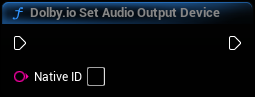

#### Inputs and outputs
| Name          | Direction | Type   | Default value | Description                  |
|---------------|:----------|:-------|:--------------|:-----------------------------|
| **Native ID** | Input     | string | -             | The ID of the device to use. |

#### Triggered events
| Event                                                                                          | When       |
|------------------------------------------------------------------------------------------------|:-----------|
| [**On Current Audio Output Device Changed**](events.md#on-current-audio-output-device-changed) | Successful |

---

## Dolby.io Set Local Player Location

Updates the location of the listener for spatial audio purposes.

Calling this function even once disables the default behavior, which is to automatically use the location of the first player controller.

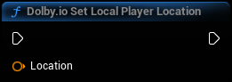

#### Inputs and outputs
| Name         | Direction | Type                                                                        | Default value | Description                   |
|--------------|:----------|:----------------------------------------------------------------------------|:--------------|:------------------------------|
| **Location** | Input     | [Vector](https://docs.unrealengine.com/5.2/en-US/BlueprintAPI/Math/Vector/) | -             | The location of the listener. |

---

## Dolby.io Set Local Player Rotation

Updates the rotation of the listener for spatial audio purposes.

Calling this function even once disables the default behavior, which is to automatically use the rotation of the first player controller.

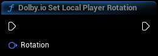

#### Inputs and outputs
| Name         | Direction | Type                                                                          | Default value | Description                   |
|--------------|:----------|:------------------------------------------------------------------------------|:--------------|:------------------------------|
| **Rotation** | Input     | [Rotator](https://docs.unrealengine.com/5.2/en-US/BlueprintAPI/Math/Rotator/) | -             | The rotation of the listener. |

---

## Dolby.io Set Log Settings

:::info 🚀 Beta
The **Log to Console** parameter is a part of the [Beta program](https://docs.dolby.io/communications-apis/docs/overview-beta-programs).

The **Log to File** parameter is a part of the [Beta program](https://docs.dolby.io/communications-apis/docs/overview-beta-programs). In previous versions, logs were always written to a file.
:::

Sets what to log in the Dolby.io C++ SDK.

This function should be called before the first call to [Set Token](#dolbyio-set-token) if the user needs logs about the plugin's operation. Calling this function more than once has no effect.

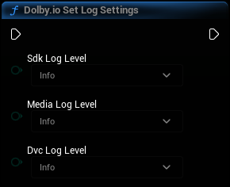

#### Inputs and outputs
| Name                | Direction | Type                                              | Default value | Description                                                                                                            |
|---------------------|:----------|:--------------------------------------------------|:--------------|:-----------------------------------------------------------------------------------------------------------------------|
| **Sdk Log Level**   | Input     | [Dolby.io Log Level](types.mdx#dolbyio-log-level) | Info          | Log level for SDK logs.                                                                                                |
| **Media Log Level** | Input     | [Dolby.io Log Level](types.mdx#dolbyio-log-level) | Info          | Log level for Media Engine logs.                                                                                       |
| **Dvc Log Level**   | Input     | [Dolby.io Log Level](types.mdx#dolbyio-log-level) | Info          | Log level for DVC logs.                                                                                                |
| **Log to Console**  | Input     | bool                                              | false         | Sets whether the logs should be displayed in the Output Log.                                                           |
| **Log to File**     | Input     | bool                                              | true          | If this is true, the logs will be written to a file in the default project log directory (e.g. Saved/Logs on Windows). |

---

## Dolby.io Set Remote Player Location

Updates the location of the given remote participant for spatial audio purposes.

This is only applicable when the spatial audio style of the conference is set to "Individual".

Calling this function with the local participant ID has no effect. Use [Set Local Player Location](#dolbyio-set-local-player-rotation) instead.

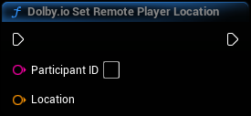

#### Inputs and outputs
| Name               | Direction | Type                                                                        | Default value | Description                             |
|--------------------|:----------|:----------------------------------------------------------------------------|:--------------|:----------------------------------------|
| **Participant ID** | Input     | string                                                                      | -             | The ID of the remote participant.       |
| **Location**       | Input     | [Vector](https://docs.unrealengine.com/5.2/en-US/BlueprintAPI/Math/Vector/) | -             | The location of the remote participant. |

---

## Dolby.io Set Spatial Environment Scale

Sets the spatial environment scale.

The larger the scale, the longer the distance at which the spatial audio attenuates. To get the best experience, the scale should be set separately for each level. The default value of "1.0" means that audio will fall completely silent at a distance of 10000 units (10000 cm/100 m).

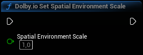

#### Inputs and outputs
| Name      | Direction | Type  | Default value | Description                           |
|-----------|:----------|:------|:--------------|:--------------------------------------|
| **Scale** | Input     | float | 1.0           | The scale as a floating point number. |

---

## Dolby.io Set Token

Initializes or refreshes the client access token. Initializes the plugin unless already initialized.

For quick testing, you can manually obtain a token from the [Dolby.io dashboard](https://dashboard.dolby.io) and paste it directly into the node. Alternatively, you can obtain a token using the [Dolby.io Get Token From URL](#dolbyio-get-token-from-url) function or the [Dolby.io Get Token Using App Key And Secret](#dolbyio-get-token-using-app-key-and-secret) function.

> ⚠️ Calling this function from multiple game instances at the same time (usually by setting "Number of Players" to more than 1 in the Editor) will likely cause one of the calls to trigger an error. It is recommended to handle the error by retrying this function after a short delay.

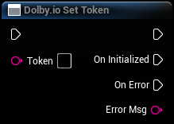

#### Inputs and outputs
| Name      | Direction | Type   | Default value | Description              |
|-----------|:----------|:-------|:--------------|:-------------------------|
| **Token** | Input     | string | -             | The client access token. |

#### Triggered events
| Event                                          | When                         |
|------------------------------------------------|:-----------------------------|
| [**On Initialized**](events.md#on-initialized) | Initialization is successful |
| [**On Error**](events.md#on-error)             | Errors occur                 |

---

## Dolby.io Start Screenshare

Starts screen sharing using a given source.

Users should make use of the parameters to optimize for the content they are sharing. For example, for sharing dynamic content like a YouTube video, the ideal settings are MaxResolution=DownscaleTo1080p, EncoderHint=Fluid, DownscaleQuality=High.

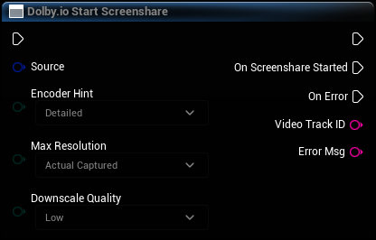

#### Inputs and outputs
| Name                  | Direction | Type                                                                                      | Default value   | Description                                                                                     |
|-----------------------|:----------|:------------------------------------------------------------------------------------------|:----------------|:------------------------------------------------------------------------------------------------|
| **Source**            | Input     | [Dolby.io Screenshare Source](types.mdx#dolbyio-screenshare-source)                       | -               | The source to use.                                                                              |
| **Encoder Hint**      | Input     | [Dolby.io Screenshare Encoder Hint](types.mdx#dolbyio-screenshare-encoder-hint)           | Detailed        | Provides a hint to the plugin as to what type of content is being captured by the screen share. |
| **Max Resolution**    | Input     | [Dolby.io Screenshare Max Resolution](types.mdx#dolbyio-screenshare-max-resolution)       | Actual Captured | The maximum resolution for the capture screen content to be shared as.                          |
| **Downscale Quality** | Input     | [Dolby.io Screenshare Downscale Quality](types.mdx#dolbyio-screenshare-downscale-quality) | Low             | The quality for the downscaling algorithm to be used.                                           |

#### Triggered events
| Event                                                          | When         |
|----------------------------------------------------------------|:-------------|
| [**On Screenshare Started**](events.md#on-screenshare-started) | Successful   |
| [**On Error**](events.md#on-error)                             | Errors occur |

---

## Dolby.io Stop Screenshare

Stops screen sharing.

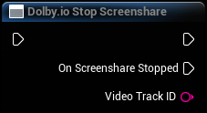

#### Triggered events
| Event                                                          | When         |
|----------------------------------------------------------------|:-------------|
| [**On Screenshare Stopped**](events.md#on-screenshare-stopped) | Successful   |
| [**On Error**](events.md#on-error)                             | Errors occur |

---

## Dolby.io Unbind Material

Unbinds a dynamic material instance to no longer hold the video frames of the given video track. The plugin will no longer update the material's texture parameter named "DolbyIO Frame" with the necessary data.

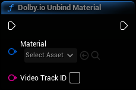

#### Inputs and outputs
| Name               | Direction | Type                                                                                                                                | Default value | Description                              |
|--------------------|:----------|:------------------------------------------------------------------------------------------------------------------------------------|:--------------|:-----------------------------------------|
| **Material**       | Input     | [Dynamic Material Instance](https://docs.unrealengine.com/5.2/en-US/BlueprintAPI/Rendering/Material/CreateDynamicMaterialInstance/) | -             | The dynamic material instance to unbind. |
| **Video Track ID** | Input     | string                                                                                                                              | -             | The ID of the video track.               |

---

## Dolby.io Unmute Input

Unmutes audio input.

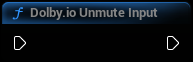

---

## Dolby.io Unmute Output

Unmutes audio output.

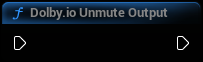

---

## Dolby.io Unmute Participant

Unmutes a given participant for the local user.

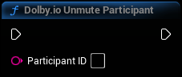

#### Inputs and outputs
| Name               | Direction | Type   | Default value | Description                                 |
|--------------------|:----------|:-------|:--------------|:--------------------------------------------|
| **Participant ID** | Input     | string | -             | The ID of the remote participant to unmute. |

---

## Dolby.io Update User Metadata

:::info 🚀 Beta
This function is a part of the [Beta program](https://docs.dolby.io/communications-apis/docs/overview-beta-programs).
:::

Updates information about the local participant.

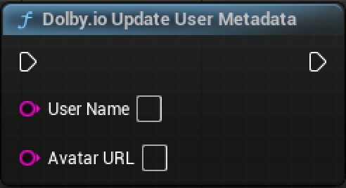

#### Inputs and outputs
| Name           | Direction | Type   | Default value | Description                          |
|----------------|:----------|:-------|:--------------|:-------------------------------------|
| **User Name**  | Input     | String | -             | The name of the participant.         |
| **Avatar URL** | Input     | String | -             | The URL of the participant's avatar. |
