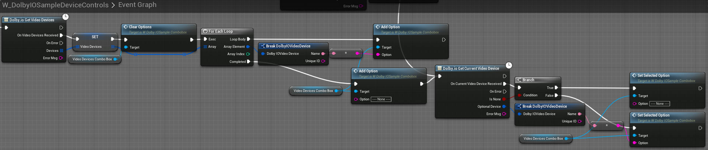
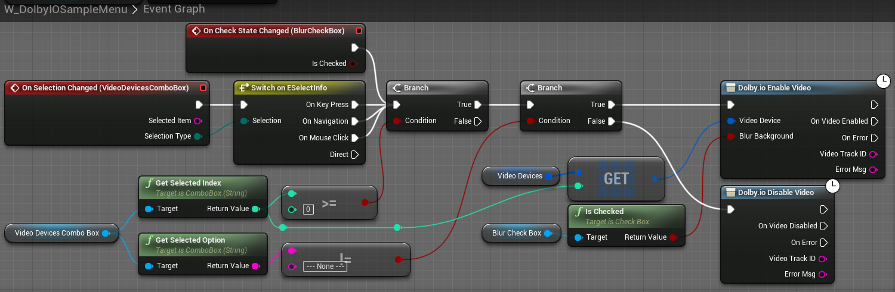

This tutorial explains how to render a preview of your camera feed.

## Prerequisites

Before you start, [set up](common-setup) your project.

## Set up camera preview

1. Find `BP_DolbyIOVideoPreviewPlane` in the plugin's content in `Content Browser` and drag it onto the scene.

> **_NOTE:_** If you do not see this item, go to the `Content Browser` settings and tick `Show Plugin Content`.

2. Rescale the plane to the desired aspect ratio, for example, [6.4, 3.6, 1.0], and rotate it by [90, 0, 90] to make it face the player start, as in the following example:

3. Open the sample menu by pressing "M".

4. Open the "Video devices" combo box and select a device to enable video streaming from that device or select "--- None ---" to disable video streaming. You should see your camera feed on the plane when you select a valid device and the plane should disappear when you select none.

## How it works

`W_DolbyIOSampleMenu` is a sample widget whose "Video devices" combo box is filled using [`Get Video Devices`](../blueprints/functions#dolbyio-get-video-devices) (and an additional "None" device) each time the widget becomes visible. We also save the devices in a variable and use [`Get Current Video Device`](../blueprints/functions#dolbyio-get-current-video-device) to select the device that is currently in use.

When you select a device from the combo box, we get a corresponding device from the variable and use [`Enable Video`](../blueprints/functions#dolbyio-enable-video) to start streaming or [`Disable Video`](../blueprints/functions#dolbyio-disable-video) if the device is "None".

`BP_DolbyIOVideoPreviewPlane` is a sample Blueprint with a simple `Event Graph`, which handles [`On Video Enabled`](../blueprints/events#on-video-enabled) and [`On Video Disabled`](../blueprints/events#on-video-disabled).

It also contains a generic `Construction Script` to set up the plane's material:

