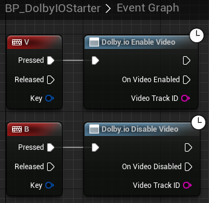
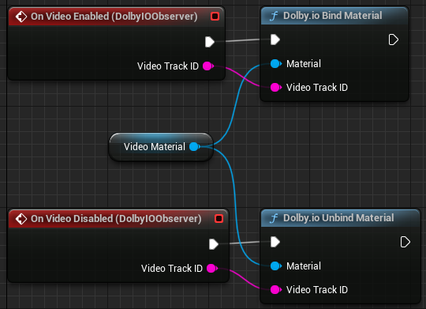

This tutorial explains how to render a preview of your camera feed.

## Prerequisites

Before you start, [set up](common-setup) your project and follow the [video plane setup](video-plane-setup) to get a plane to render the preview on.

## Set up camera preview

1. Find `BP_DolbyIOVideoPreviewPlane` in the plugin's content in `Content Browser` and drag it onto the scene.

> **_NOTE:_** If you do not see this item, go to the `Content Browser` settings and tick `Show Plugin Content`.

2. Rescale the plane to the desired aspect ratio, for example, [6.4, 3.6, 1.0], and rotate it by [90, 0, 90] to make it face the player start, as in the following example:

3. Test the camera preview by going to the `BP_FirstPersonCharacter` Blueprint and adding the following nodes to enable video with the "V" key and disable it with the "B" key:

If you launch the game now, assuming the plugin is initialized correctly, you should see your camera feed on the plane when you press "V" and the plane should go blank when you press "B".

## How it works

`BP_DolbyIOVideoPreviewPlane` is a sample Blueprint with a simple `Event Graph`, which handles [`On Video Enabled`](../blueprints/Events/on-video-enabled) and [`On Video Disabled`](../blueprints/Events/on-video-enabled).

It also contains a generic `Construction Script` to set up the plane's material:

As a useful practical exercise, you can also make the plane invisible by default, then make it visible when video is enabled and invisible again when it is disabled.
