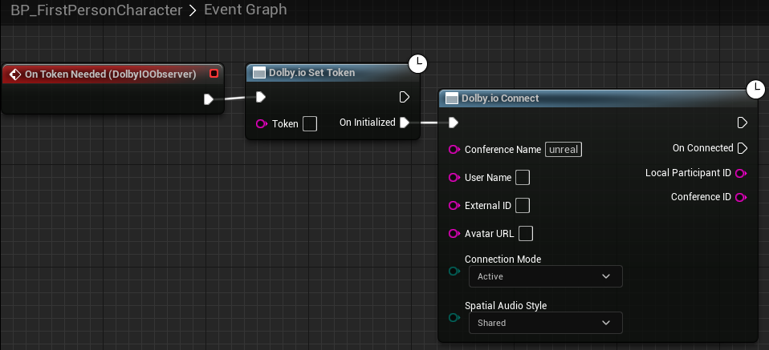

## Prerequisites

All of the tutorials will be based on a scene set up using Unreal Engine 5's First Person game template.

## Initialization

For all tutorials, we need to initialize the plugin. We could do this from multiple places (such as the game instance, the level Blueprint, etc.), but for this example we will use the First Person Character Blueprint since it is already in the template and will do just fine. Therefore, in the Content Browser, open `All -> Content -> FirstPerson -> Blueprints -> BP_FirstPersonCharacter`.

> **_NOTE:_** If you set up the project from a C++ template, click `Open Full Blueprint Editor`.

Add `Dolby.io Observer` as a component and add a handler for the `On Token Needed` event. Wire the nodes as presented below, pasting your client access token in the `Dolby.io Set Token` node:

> **_NOTE:_** In development, you may also use the [`Get Dolby.io Token`](../blueprints/Functions/get-token.md) helper to use your app key and secret instead.

If set up correctly, this should connect you to the conference name specified in the [`Dolby.io Connect`](../blueprints/Functions/connect.md) node upon game start.

> **_NOTE:_** If this does not work, try following the [Getting started - first conference](first-conference) tutorial first.

## Video material

If you intend to work with video, it is recommended to set up a material for easy rendering using the [`Dolby.io Bind Material`](../blueprints/Functions/bind-material.md) function.

Create a new material anywhere within Content, name it `M_DolbyIOVideo` and open its editor. Add a `Texture Sample` node (e.g. 'T' + left click), right-click on the node and select `Convert to Parameter` and name this parameter `DolbyIO Frame`. To properly set up this material, for simplicity's sake, we need to give this node a base texture that will be displayed when there is no video to be displayed - let's select UE4_LOGO_CARD for example. Then wire it up as seen below:

> **_NOTE:_** All names in tutorials are only suggestions, except the `DolbyIO Frame` parameter name, which is necessary because [`Dolby.io Bind Material`](../blueprints/Functions/bind-material.md) requires this specific name.
