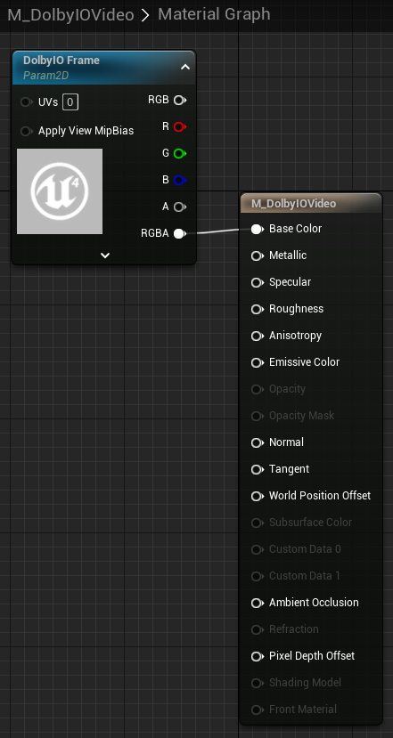

This tutorial explains how to initialize the plugin and set up video material.

## Prerequisites

Make sure that you use a scene setup and the Unreal Engine 5 First Person game template.

## Initialize the plugin

You can initialize the plugin from multiple places, such as the game instance or the level Blueprint, but in this example, we will use the First Person Character Blueprint since it is already in the template. 

1. In the Content Browser, open `All -> Content -> FirstPerson -> Blueprints -> BP_FirstPersonCharacter`. If you set up the project from a C++ template, click `Open Full Blueprint Editor`.

2. Add `Dolby.io Observer` as a component and add a handler for the [`On Token Needed`](../blueprints/Events/on-token-needed) event. Wire the nodes as presented in the following example and paste your client access token into the [`Dolby.io Set Token`](../blueprints/Functions/set-token) node.

In development, you may also use the [`Get Dolby.io Token`](../blueprints/Functions/get-token) helper to use your app key and secret instead.

After this step, you should connect to a conference that has a name that you specified in the [`Dolby.io Connect`](../blueprints/Functions/connect) node upon starting your game. If you cannot connect, follow the [Getting started - first conference](first-conference) tutorial first.

## Set up a video material

If you intend to work with video, set up a material for easy rendering using the [`Dolby.io Bind Material`](../blueprints/Functions/bind-material) function.

1. Create a new material anywhere within Content, name it `M_DolbyIOVideo`, and open its editor. 

2. Add a `Texture Sample` node, for example, 'T' + left click, right-click the node and select `Convert to Parameter`. Name this parameter `DolbyIO Frame`. 

3. To properly set up this material, you need to give this node a base texture that will be displayed when there is no video to be displayed. For example, you can select UE4_LOGO_CARD. Then, wire it up as in the following example:

All names in this tutorial are only suggestions, except the `DolbyIO Frame` parameter name, which is necessary because [`Dolby.io Bind Material`](../blueprints/Functions/bind-material) requires this specific name.

You can also modify your own material and simply add a texture parameter named `DolbyIO Frame`. Then, you can use it however you wish.
