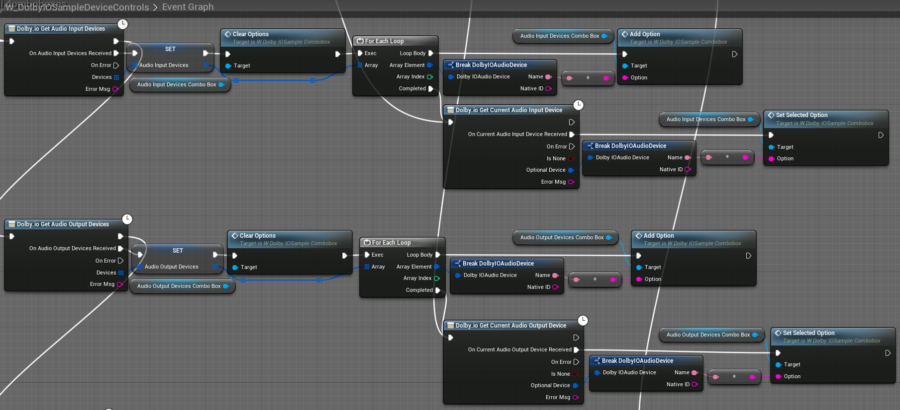
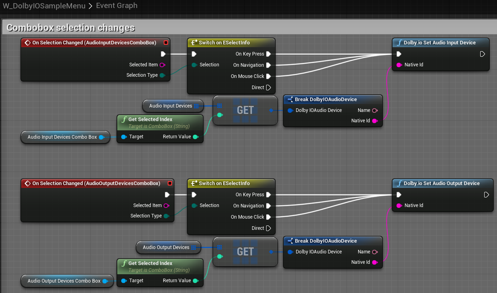
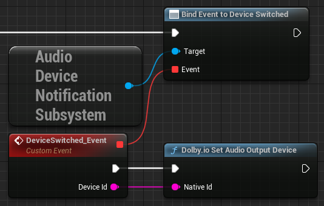

This tutorial explains how to set up audio device management with a simple user interface.

## Prerequisites

Before you start, follow the [common setup](common-setup) tutorial.

## Sample menu

1. Open the sample menu by pressing "M".

2. Open the "Audio input devices" combo box and select the desired device. The plugin should now use that device for audio input.

3. Open the "Audio output devices" combo box and select the desired device. The plugin should now use that device for audio output.

## How it works

`W_DolbyIOSampleMenu` is a sample widget whose "Audio input devices" and "Audio output devices" combo boxes are filled using [`Get Audio Input Devices`](../blueprints/functions#dolbyio-get-audio-input-devices) and [`Get Audio Output Devices`](../blueprints/functions#dolbyio-get-audio-output-devices) each time the widget becomes visible. We also save the input and output devices in variables and use [`Get Current Audio Input Device`](../blueprints/functions#dolbyio-get-current-audio-input-device) and [`Get Current Audio Output Device`](../blueprints/functions#dolbyio-get-current-audio-output-device) to select the devices that are currently in use.

When you select a device from the combo box, we get a corresponding device from a variable and use [`Set Audio Input Device`](../blueprints/functions#dolbyio-set-audio-input-device) or [`Set Audio Output Device`](../blueprints/functions#dolbyio-set-audio-output-device).

## Using the same audio output device as Unreal Engine 5

In Unreal Engine 5, you can ensure the plugin uses the same audio output device as the engine itself by handling the engine's `Audio Device Notification Subsystem`'s `Device Switched` event as shown below:

