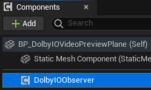
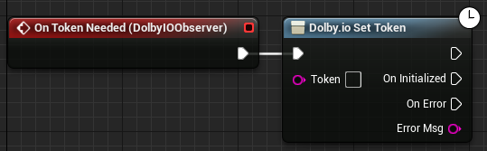
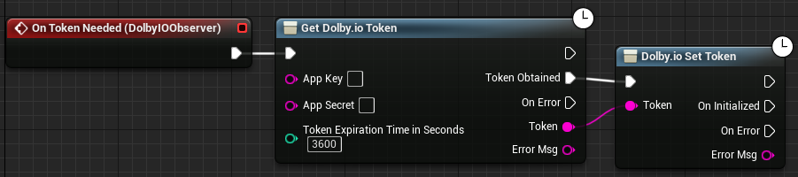
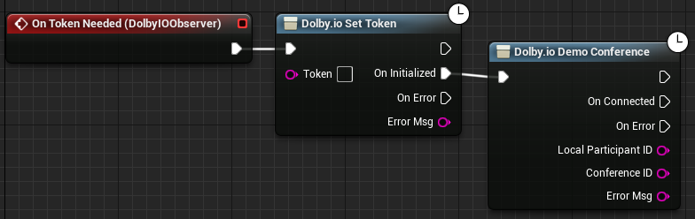

The following steps present how to create a sample game which uses the plugin and connects to a demo conference. It is based on the Unreal Engine 5 First Person game template.

## 1. Open Event Graph
Open Unreal Editor and locate the `All/Content/Blueprints/FirstPerson` folder in the `Content Browser` window. Select the folder and open the `BP_FirstPersonCharacter` Blueprint.

## 2. Add `DolbyIOObserver` component
Click the `+Add` button located in the `Components` window and select `Dolby.io Observer`.

## 3. Configure access credentials
Select the added component and check its details in the `Details` panel. Scroll down to the `Events` section to see the available events. Select the [`On Token Needed`](../blueprints/events#on-token-needed) event from the list by clicking the plus button next to it. After this step, an `On Token Needed (DolbyIOObserver)` node should appear in the Event Graph.

### Option A - Use client access token
1. Place a [`Dolby.io Set Token`](../blueprints/functions#dolbyio-set-token) node and connect it to the `On Token Needed (DolbyIOObserver)` node.

2. Paste your client access token copied from the Dolby.io dashboard to the [`Dolby.io Set Token`](../blueprints/functions#dolbyio-set-token) node.

### Option B - Use app key and secret
1. Place a [`Get Dolby.io Token`](../blueprints/functions#get-dolbyio-token) node and connect it to the `On Token Needed (DolbyIOObserver)` node.

2. Place a [`Dolby.io Set Token`](../blueprints/functions#dolbyio-set-token) node and connect it to the [`Get Dolby.io Token`](../blueprints/functions#get-dolbyio-token) node as shown below:

3. Provide your app key and app secret to the [`Get Dolby.io Token`](../blueprints/functions#get-dolbyio-token) function.

## 4. Connect to demo conference  
Place a [`Dolby.io Demo Conference`](../blueprints/functions#dolbyio-demo-conference) node and connect it to the [`Dolby.io Set Token`](../blueprints/functions#dolbyio-set-token) node as shown below:

## 5. Run the game
You should now be able join a demo conference and hear audio from its participants. If you are not able to join the conference, check the `Output Log` for clues - in particular, check whether the credentials are set up appropriately.