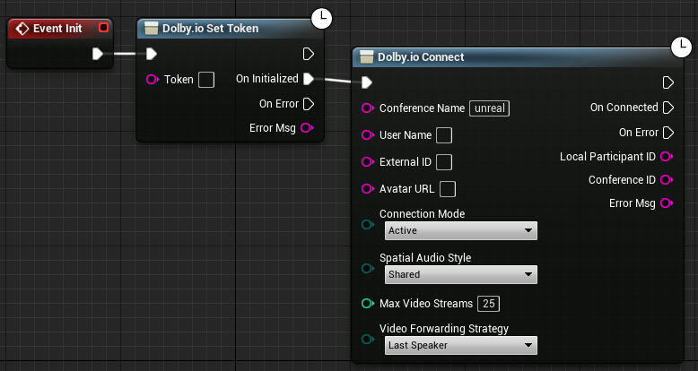
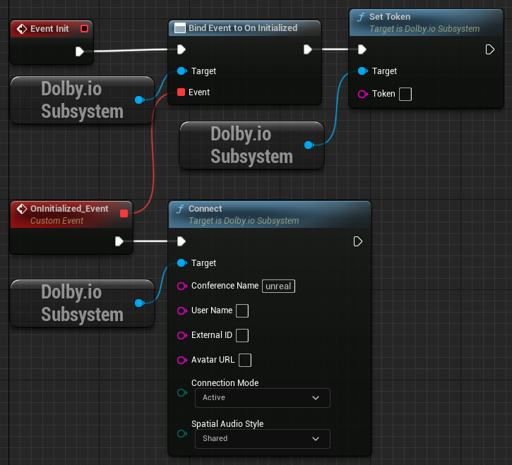
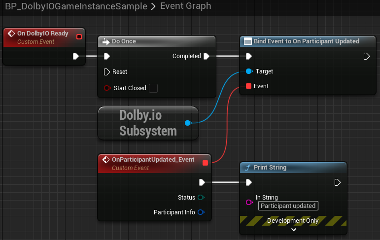
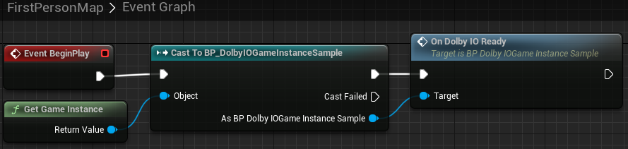

This tutorial explains how to use the plugin when working from within a game instance.

## Prerequisites

The sample Blueprints included with the plugin are designed in Unreal Engine 5.1 and will not work with previous versions. You can still use previous versions to follow the tutorials but you will not be able to use the sample Blueprints and will need to create them from scratch.

## Starting notes

The plugin's core class is a game instance subsystem. This means that its state is persistent throughout the game. It also means that it is created after the game instance. Therefore we cannot use it this way from a game instance Blueprint:

This is because this sequence is equivalent to:

However, at the moment `Event Init` is called, the `Dolby.io Subsystem` does not yet exist, so nothing will happen. Nor is there any other event within the base game instance that can tell us that the subsystem does exist. We have therefore provided a sample showing how to overcome this issue.

## How the sample works

Suppose you want to handle the [`On Participant Updated`](../blueprints/Events/on-participant-updated) event from within the game instance.

1. Find `BP_DolbyIOGameInstanceSample` in the plugin's content in `Content Browser` and open its `Event Graph`.

> **_NOTE:_** If you do not see this item, go to the `Content Browser` settings and tick `Show Plugin Content`.

2. Notice that we are creating an event to tell the game instance that the `Dolby.io Subsystem` is ready for use. From within this event handler we can now assign event handlers to the plugin's events as shown below:

3. Copy these nodes into your own game instance or change the project settings to use `BP_DolbyIOGameInstanceSample`.

4. Call `On DolbyIO Ready` from any Blueprint instantiated after the game is started. A good idea is to do this from the `BeginPlay` event of the starting level Blueprint:

The game instance should now be set up to handle the [`On Participant Updated`](../blueprints/Events/on-participant-updated) event. You can use this method for other events as well by chaining `Bind Event` calls. In theory it is possible to control the plugin entirely from a game instance, however doing so is less convenient than using the `Dolby.io Observer` actor component.
