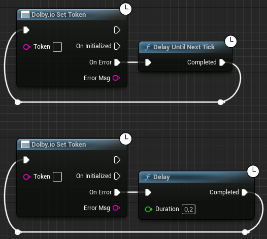

If multiple games call [Set Token](../blueprints/functions.md#dolbyio-set-token) at the same time, which is likely to happen when using "Number of Players" with a value of more than 1 in the editor, then it is likely that one of these calls will trigger an error. We recommend handling the error by retrying this function after a short delay. Usually, one tick is enough, but if you have time, we recommend setting a longer delay:

There is a known issue with the initialization and deinitialization of the plugin with the workaround above when playing games in the "Selected Viewport". The user can expect sporadic crashes to occur when launching or closing games. These issues do not occur when playing games as "Standalone Games". Therefore, we recommend using the latter option when setting "Number of Players" to more than 1. 
