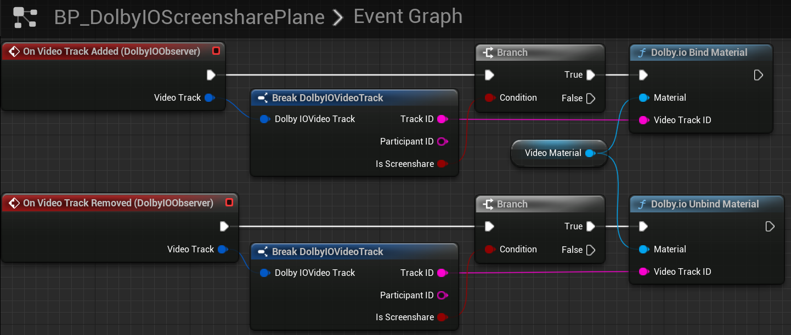

This tutorial explains how to render screen share feeds coming from remote participants.

## Prerequisites

Before you start, follow the [common setup](common-setup) tutorial.

## Set up a remote screen share preview

1. Find `BP_DolbyIOScreensharePlane` in the `VideoSamples` folder of the plugin's content in `Content Browser` and drag it onto the scene.

> **_NOTE:_** If you do not see this item, go to the `Content Browser` settings and tick `Show Plugin Content`.

2. Rescale the plane to the desired aspect ratio, for example, [6.4, 3.6, 1.0], and rotate it by [90, 0, 90] to make it face the player start, as in the following example:

If you launch the game now, assuming you successfully connect to a conference with screen share enabled, you should see the screen share feed on the plane.

## How it works

`BP_DolbyIOScreensharePlane` is a sample Blueprint with a simple `Event Graph`, which handles [`On Video Track Added`](../blueprints/events#on-video-track-added) and [`On Video Track Removed`](../blueprints/events#on-video-track-removed).

It also contains a generic `Construction Script` to set up the plane's material:

