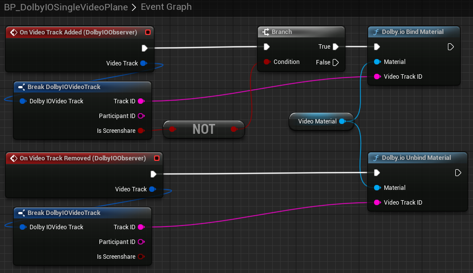

## Setup

This tutorial showcases how to render camera video coming from other participants.

Please follow the [common setup](common-setup) steps first.

Then please follow the [video plane setup](video-plane-setup) steps to get a plane to render the preview on.

## Remote video

Open the video plane's `Event Graph` and add handlers for the [`On Video Track Added`](../blueprints/Events/on-video-track-added) and [`On Video Track Removed`](../blueprints/Events/on-video-track-removed) events of the `DolbyIOObserver` and wire them up as follows:

> **_NOTE:_** This particular implementation allows only one remote video feed. Under normal conditions, users will likely create multiple planes, assign them to specific participants and heavily modify this sample.

If you launch the game now, assuming you successfully connect to a conference with at least one remote participant video enabled, you should see one video feed on the plane.
