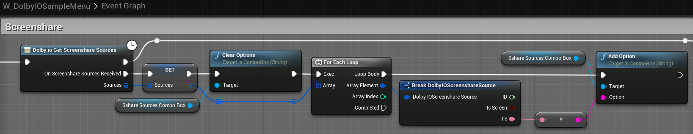

This tutorial explains how to render a preview of your screen share feed.

## Prerequisites

Before you start, follow the [common setup](common-setup) tutorial.

## Set up a screen share preview

1. Find `BP_DolbyIOScreensharePreviewPlane` in the `VideoSamples` folder of the plugin's content in `Content Browser` and drag it onto the scene.

> **_NOTE:_** If you do not see this item, go to the `Content Browser` settings and tick `Show Plugin Content`.

2. Rescale the plane to the desired aspect ratio, for example, [6.4, 3.6, 1.0], and rotate it by [90, 0, 90] to make it face the player start, as in the following example:

3. Open the sample menu by pressing "M".

4. Open the "Screenshare sources" combo box and select the desired source. Assuming there is no conflicting screen share going on, you should see your screen share feed on the plane after pressing the "Start screenshare" button and the plane should disappear when you press "Stop screenshare".

## How it works

`W_DolbyIOSampleScreenshareControls` is a sample widget whose "Screenshare sources" combo box is filled using [`Get Screenshare Sources`](../blueprints/functions#dolbyio-get-screenshare-sources). We also save the sources in a variable.

:::info 🚀 Beta
The `W_DolbyIOSampleScreenshareControls` widget is a part of the [Beta program](https://docs.dolby.io/communications-apis/docs/overview-beta-programs). In previous versions, the plugin uses `W_DolbyIOSampleMenu`.
:::

When you click "Start screenshare", we match the selected source from the combo box with the corresponding source from the variable, get other parameters from their combo boxes and [`Start Screenshare`](../blueprints/functions#dolbyio-start-screenshare).

Additionally, whenever you change the screen share parameters using their combo boxes, we call [`Change Screenshare Parameters`](../blueprints/functions#dolbyio-change-screenshare-parameters). It is safe to call this function whenever a combo box selection changes even when screen share is not started, because it does nothing in that case.

Finally, we simply [`Stop Screenshare`](../blueprints/functions#dolbyio-stop-screenshare) when the "Stop screenshare" button is clicked.

`BP_DolbyIOScreensharePreviewPlane` is a sample Blueprint with a simple `Event Graph`, which handles [`On Screenshare Started`](../blueprints/events#on-screenshare-started) and [`On Screenshare Stopped`](../blueprints/events#on-screenshare-stopped).

It also contains a generic `Construction Script` to set up the plane's material:

