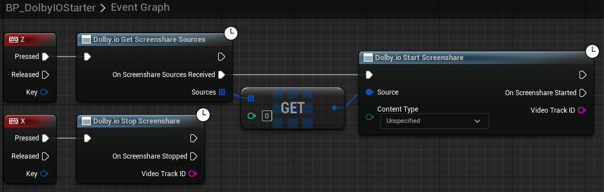
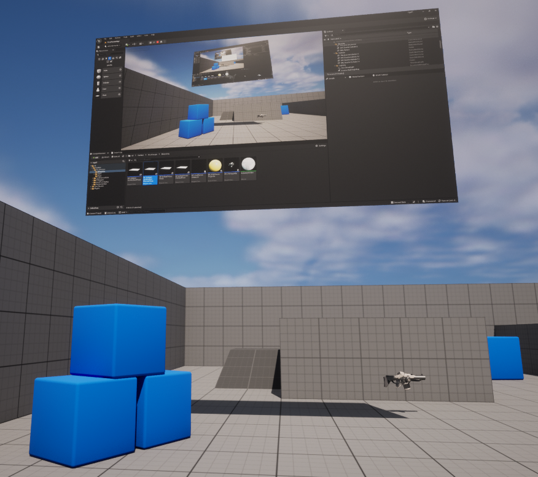
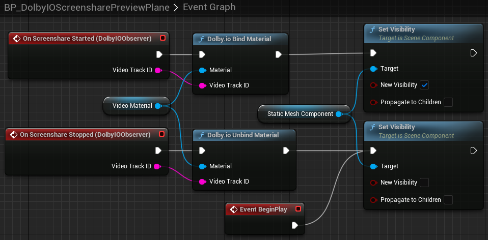

## Setup

This tutorial showcases how to render a preview of your screenshare feed.

Please follow the [common setup](common-setup) steps first.

## Screenshare preview

Find `BP_DolbyIOScreensharePreviewPlane` in the plugin's content in `Content Browser` and drag it onto the scene. Preferably put it in front of the player start position, rescale it to the desired aspect ratio (here: [6.4, 3.6, 1.0]) and rotate it by [90, 0, 90] to make it face the player start. You should end up with something like this (except `BP_DolbyIOScreensharePreviewPlane` instead of `BP_DolbyIOVideoPreviewPlane`):

> **_NOTE:_** If you do not see this item, go to the `Content Browser` settings and tick `Show Plugin Content`.

Let's test this by going to the `BP_FirstPersonCharacter` Blueprint and adding the following nodes to enable video with the "Z" key and disable it with the "X" key:

> **_NOTE:_** This particular example will always share the first available screenshare source, which is likely going to be the primary monitor screen. Selecting an appropriate screenshare source is out of the scope of this tutorial as it will likely require some UI to parse the available screenshare sources (received using [`Dolby.io Get Screenshare Sources`](../blueprints/Functions/get-screenshare-sources)) into some sort of menu. The general flow however remains the same: get screenshare sources, choose desired source from list, start screenshare using this source.

If you launch the game now, assuming you connect to the conference successfully and there is no conflicting screenshare going on, you should see your screenshare feed on the plane when you press "Z" and the plane should go blank when you press "X".

## How it works

`BP_DolbyIOScreensharePreviewPlane` is a sample Blueprint with a simple `Event Graph`, which handles [`On Screenshare Started`](../blueprints/Events/on-screenshare-started) and [`On Screenshare Stopped`](../blueprints/Events/on-screenshare-stopped).

It also contains a generic `Construction Script` to set up the plane's material:

> **_NOTE:_** As a useful practical exercise, you can also make the plane invisible by default, then make it visible when screenshare is started and invisible again when it is stopped.
