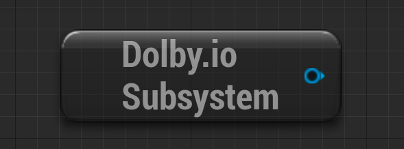
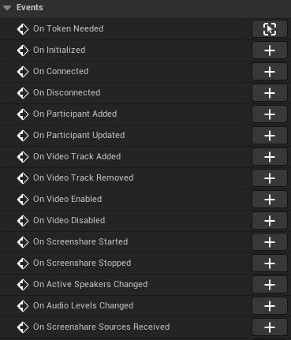
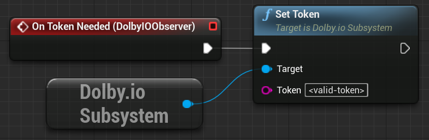
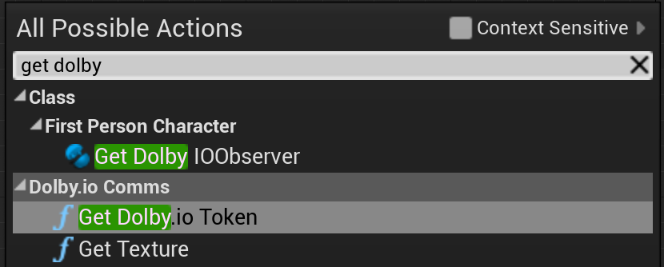

After enabling the plugin, you need to use the `Dolby.io Subsystem` node in Blueprints to be able to use the available features. The node is responsible for handling the Dolby.io subsystem. Additionally, you need to add the [On Token Needed](../blueprints/events/on-token-needed) and [On Initialized](../blueprints/events/on-initialized) events to be able to initialize the plugin.

The following steps present how to create a sample application that uses the plugin:

### Step 1 - Open the Event Graph
Open your Unreal Editor and locate the `Blueprints` folder in the `Content Browser` window. Open the folder and open the `FirstPersonCharacter` Blueprint. This step should open the Event Graph for the selected Blueprint.

### Step 2 - Import `DolbyIOSubsystem`
Right-click the empty space in the Blueprint to see a list of all nodes that can be added to the graph and select `Get DolbyIOSubsystem` from the list. After this step, you should have the `Dolby.io Subsystem` node in your editor.

### Step 3 - Add `DolbyIOObserver`
Click the `+Add Component` button located in the `Components` window and select `DolbyIOObserver`.

Select the added component and check its details in the `Details` panel. Scroll down to the `Events` section to see the available events.

### Step 4 - Configure access credentials
Select the `On Token Needed` event from the list by clicking the add button (+). After this step, an `On Token Needed (DolbyIOObserver)` element should appear in your editor.

Provide either your token or your app key and app secret to the event.

#### Use client access token
If you want to use a client access token, follow these steps:

- Drag a node off `Dolby.io Subsystem` and select the `Set Token` action.

- Connect the `On Token Needed (DolbyIOObserver)` element with the `Set Token` action.

- Provide your client access token copied from the Dolby.io dashboard to the `Set Token` action.

#### Use Get Token function
If you want to use an app key and an app secret, follow these steps:

- Right-click the empty space in the Blueprint to see the `All Possible Actions` window. Tick off `Context Sensitive` to see all available components and actions and add a `Get Dolby.io Token` function.

- Drag a node off `Dolby.io Subsystem` and select the `Set Token` action.

- Connect `On Token Needed` with `Get Dolby.io Token`.

- Connect the `Token Obtained` execution pin from `Get Dolby.io Token` to `Set Token` and connect their `Token` pins.

- Provide your app key and app secret to the `Get Dolby.io Token` function.

### Step 5 - Connect to Demo conference  

- Add an [On Initialized](../blueprints/events/on-initialized) event by clicking the add button (+) next to the event located in the `Details` panel. After this step, the `On Initialized (DolbyIOObserver)` element should appear in the main window.

- Right-click the empty space in the Blueprint, add a [Demo Conference](../blueprints/Functions/demo-conference) component, and connect the component with the `On Initialized` event.

- Connect the `Target` pins of `Demo Conference` and `Dolby.io Subsystem`.

- Run the game. After this step, you should be able join a demo conference in your game and hear the audio from the demo conference participants in-game.
