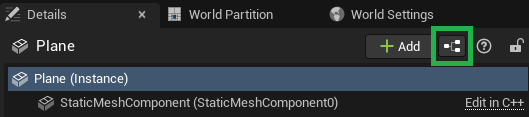

For all the video-related tutorials, we need some surfaces to display the videos on. This can be accomplished in multiple ways, such as in a HUD or widgets, but for simplicity. However, we will use plain old planes to render the video feeds. 

1. Drag and drop a plane from the `Place Actors` window onto the scene. Preferably put it in the front of the player's start position.

2. Rescale the plane to the desired aspect ratio, for example, [6.4, 3.6, 1.0], and rotate it by [90, 0, 90] to make it face the player start, as in the following example:

3. Provide material for the video that you wish to display on the plane. To do it, follow [these steps](common-setup#video-material). Then, click on the highlighted button to convert the plane into a Blueprint:

4. Edit the newly-created Blueprint and place the following nodes in the `Construction Script`:

5. Create a dynamic material instance of type `M_DolbyIOVideo`, promote it to a variable, and set it as the plane's material.

6. Turning to the `Event Graph`, you may delete anything that was put there automatically and add `Dolby.io Observer` as a component:

