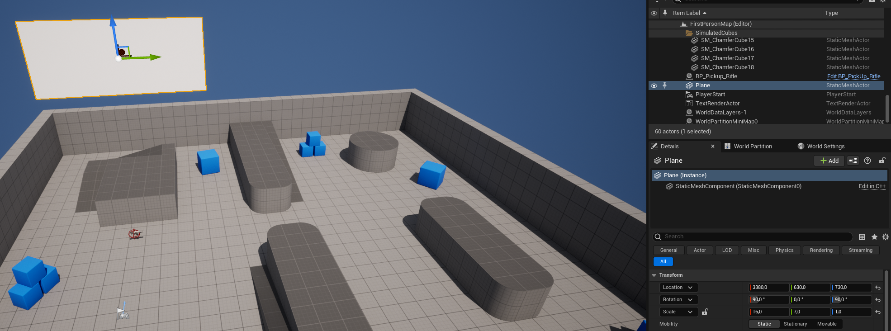
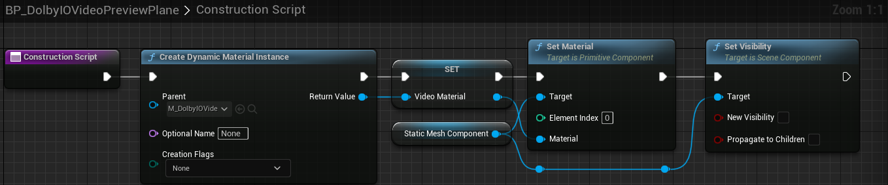
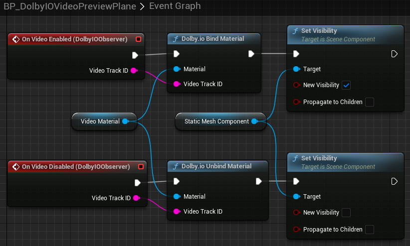
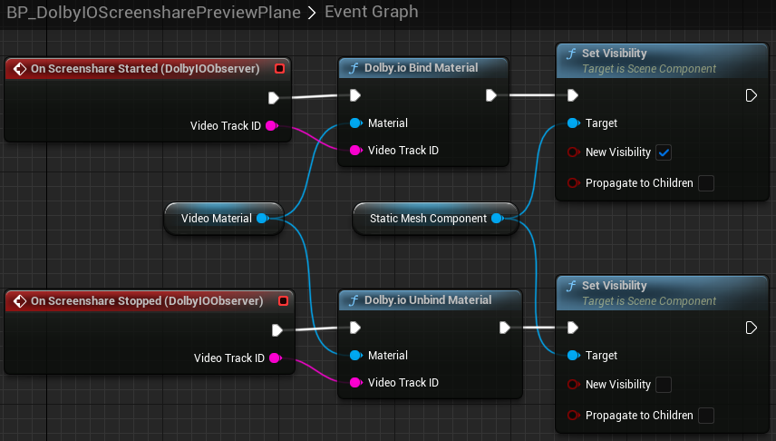
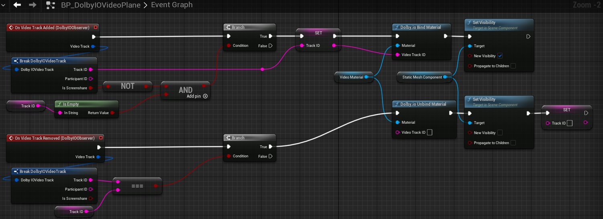
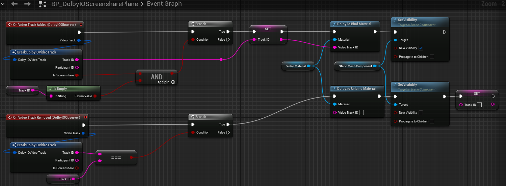

This tutorial showcases how to render incoming video as well as previews of your camera feed and of your screenshare feed. We will set up a scene using Unreal Engine 5.1.1's First Person game template. The scene will contain four planes rendering, from left to right: your camera feed, your screenshare feed, one conference screenshare and one conference camera video.

## Initialization

Firstly, we need to initialize the plugin. We could do this from multiple places (such as the game instance, the level Blueprint, etc.), but for this example we will use the First Person Character Blueprint since it is already in the template and will do just fine. Therefore, in the Content Browser, open `All -> Content -> FirstPerson -> Blueprints -> BP_FirstPersonCharacter`.

> **_NOTE:_** If you set up the project from a C++ template, click `Open Full Blueprint Editor`.

Add "Dolby.io Observer" as a component and add a handler for the `On Token Needed` event. Wire the nodes as presented below, pasting your client access token in the `Dolby.io Set Token` node (or use the `Get Dolby.io Token` helper to use your app key and secret instead):

If set up correctly, this should connect you to the conference name specified in the `Dolby.io Connect` node upon game start.

## Camera preview

Next up, we need some surfaces to display the videos on. This can also be done in multiple ways (e.g. in a HUD or in some menu-like widgets), but for simplicity we will use plain old planes to render the video feeds. Drag and drop a plane from the the Place Actors window onto the scene. Preferably put it forwards of the player start position, rescale it to the desired aspect ratio (here: [6.4, 3.6, 1.0]) and rotate it by [90, 0, 90] to make it face the player start. You should end up with something like this:

The plane needs an appropriate material for the videos to be displayed correctly. Create a new material anywhere within Content and name it M_DolbyIOVideo. Apply the material onto the plane and open its editor. Add a `Texture Sample` node (e.g. 'T' + left click), right-click on the node and select "Convert to Parameter" and name this parameter "DolbyIO Frame". To properly set up this material, for simplicity's sake, we need to give this node a base texture that will be displayed when there is no video to be displayed - let's select UE4_LOGO_CARD for example. Then wire it up as seen below:

> **_NOTE:_** All names in this tutorial are only suggestions, except the "DolbyIO Frame" parameter name, which is necessary because we will be making use of the `Dolby.io Bind Material` function later on.

Apply the changes, save the material, close the material editor and apply the material onto the plane.

Let's now make this plane smart enough to render your camera feed. First, click on the highlighted button to convert the plane into a Blueprint:

Name it BP_DolbyIOVideoPreviewPlane and open its editor. In the Construction Script, place the following nodes:

That is, create a dynamic material instance of type M_DolbyIOVideo, promote it to a variable, set it as the plane's material and make the plane invisible. Turning to the Event Graph, you may delete anything put there automatically and instead add "Dolby.io Observer" as a component and add handlers for the `On Video Enabled` and `On Video Disabled` events and wire them up as follows:

This will automatically make the plane render your camera feed when it is enabled and hide itself when there is nothing to display.

Let's test this by going back to the BP_FirstPersonCharacter Blueprint and adding the following nodes to enable video with the "V" key and disable it with the "B" key:

If you launch the game now, assuming the plugin is initialized correctly, you should see your camera feed on the plane when you press "V" and the plane should disappear when you press "B".

## Screenshare preview

Let's now create another plane to display your local screenshare feed. The easiest way to proceed will be to make a copy of the BP_DolbyIOVideoPreviewPlane and name the copy BP_DolbyIOScreensharePreviewPlane. Place the plane in the scene next to the video preview plane (rotating and scaling it appropriately). Open the Blueprint's Event Graph and replace "On Video Enabled" and "On Video Disabled" with "On Screenshare Started" and "On Screenshare Stopped" respectively:

Let's test this by going back to the BP_FirstPersonCharacter Blueprint and adding the following nodes to start screenshare with the "Z" key and stop it with the "X" key:

If you launch the game now, assuming you connect to the conference successfully and there is conflicting screenshare going on, you should see your screenshare feed on the second plane when you press "Z" and the plane should disappear when you press "X".

> **_NOTE:_** This particular example will always share the first available screenshare source, which is likely going to be the primary monitor screen. Selecting an appropriate screenshare source is out of the scope of this tutorial as it will likely require some UI to parse the available screenshare sources (received using `Dolby.io Get Screenshare Sources`) into some sort of menu. The general flow however remains the same: get screenshare sources, choose desired source from list, start screenshare using this source.

## Remote video

Let's now create planes to display incoming screenshare and camera feeds. We'll repeat the process of working from a copy of the previous plane, so create a copy named BP_DolbyIOVideoPlane, place it appropriately in the scene and edit it as such:

## Remote screenshare

Then, copy BP_DolbyIOVideoPlane as BP_DolbyIOScreensharePlane, place it and edit the logic for checking for `Is Screenshare`:

> **_NOTE:_** BP_DolbyIOVideoPlane and BP_DolbyIOScreensharePlane are so similar that in practice they would likely be one parameterized Blueprint, but we duplicate the design for simplicity. Also note that this implementation specifically allows only one remote video feed and one remote screenshare feed. Under normal conditions, users will likely create multiple video planes and assign them to specific participants.

With this example complete, you should have a working set up for showing your local previews as well as one remote video and one remote screenshare feed.
